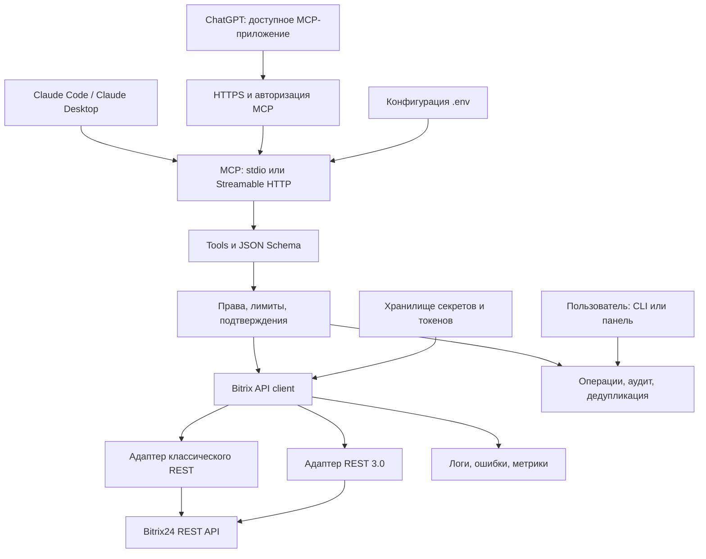

# Техническое задание: MCP-сервер для Bitrix24

Версия: 1.0. Дата проверки документации: 22.09.2026. Язык реализации: TypeScript. Заказчик: Павел. Назначение документа: передача в Claude Code для реализации и сопровождения запуска.

Статус: проектное ТЗ, основанное на официальной документации. Доступа к реальному порталу заказчика при подготовке не было; тариф, права, установленные модули, поля и поведение конкретного портала не проверены.

Все семь приложенных скриншотов доступны визуально в сообщении и учтены. Локальные копии JPG по переданным путям недоступны; это не помешало прочитать встроенные изображения. Надпись `Ask` на скриншотах обозначает настройку подтверждения инструментов в клиенте, а не REST-скоуп Bitrix24. Названия инструментов другого интегратора не являются доказательством наличия одноимённых методов публичного API.

В документе: **Факт** — подтверждённая возможность из источников; **Решение ТЗ** — обязательное проектное решение; **Проверить на портале** — условие, которое нельзя установить без подключения. Ссылки `[Sxx]` раскрыты в приложении A.

## 1. Краткое описание проекта

Создать отдельный сервер `bitrix24-mcp-server`, преобразующий строго проверенные вызовы MCP tools в разрешённые операции Bitrix24 REST API. Пользователь ставит задачу в Claude Code, Claude Desktop либо совместимом ChatGPT; клиент вызывает инструмент; сервер проверяет доступ и подтверждение, обращается в Bitrix24 и возвращает структурированный результат.

Сервер не должен самостоятельно принимать бизнес-решения, генерировать сообщения, выбирать получателей по догадке или вызывать языковую модель. Токены OpenAI/Anthropic для собственно MCP-сервера не нужны. Claude Code выступает сначала разработчиком, затем может быть MCP-клиентом. ChatGPT и Claude Code подключаются к серверу независимо; соединения «Claude Code → ChatGPT → Bitrix24» проект не требует.

Основной пользователь первой версии — один владелец интеграции на одном портале. Реализация должна работать на Windows и Linux локально через `stdio`, а на сервере — через защищённый Streamable HTTP. Возможности сгруппировать по модулям CRM, задачи, календарь, чаты, лента, Диск, каталог, склад, счета, смарт-процессы, группы, сотрудники, структура, база знаний.

Граница ответственности: MCP-сервер отвечает за проверку параметров, свою авторизацию, политику операций, подтверждения, вызовы API, нормализацию ошибок, журнал аудита. Bitrix24 отвечает за собственные права, выполнение роботов, сохранение данных и ограничения тарифа. MCP-клиент отвечает за диалог с человеком и своё отображение инструментов. Все три слоя безопасности обязательны и не заменяют друг друга.

## 2. Цели и нецели

### 2.1. Обязательные результаты

1. Рабочий MVP из 11 инструментов раздела 10, с тестами и инструкцией для новичка.
2. Два транспорта одного ядра: `stdio` и Streamable HTTP; одинаковые ограничения операций.
3. Входящий вебхук как первый способ связи с Bitrix24, интерфейс `AuthProvider` для последующего OAuth.
4. Полный реестр инструментов раздела 9 с явным статусом реализации и доступности.
5. Строгие схемы входа/выхода, серверные права, пагинация, таймауты, ограничение объёма данных.
6. Безопасный прямой вызов зарегистрированных REST-методов, без обхода политики именованного инструмента.
7. Раздельные адаптеры классического REST и REST 3.0. Для MVP достаточно классического REST; для `note.*` и современных комментариев задач требуется REST 3.0.
8. Реальные изменения только после предусмотренного подтверждения, с защитой от повторной отправки.
9. README, `.env.example`, Dockerfile, Compose, примеры MCP-конфигураций, эксплуатационная инструкция и отчёт проверки.

### 2.2. Не входит в первую версию

- Многопользовательский SaaS, несколько порталов, биллинг и публикация в Маркетплейсе.
- Полная копия CRM, постоянная выгрузка всего портала, RAG, векторная БД, собственная LLM.
- Исходящие звонки, рассылки, оплата счетов, движения товаров и изменение складских остатков.
- Интеграции с 1С, WhatsApp, Telegram, MAX и Mango; API чатов Bitrix24 не означает автоматическую поддержку этих каналов.
- Массовые удаления, изменение прав доступа, приглашение/увольнение сотрудников.
- Работа через внутренние AJAX-endpoints Bitrix24, cookies браузера, эмуляцию интерфейса или прямое изменение БД портала.
- Универсальное восстановление удалённых сущностей: API и бизнес-процессы не обеспечивают общего отката.

### 2.3. Последующие этапы

OAuth к Bitrix24, OAuth-защита удалённого MCP, подключение ChatGPT, все модули реестра, административные операции структуры и удаления — отдельные этапы. Минимальная панель просмотра и подтверждения операций входит в удалённый этап; полноценная административная CRM-панель не нужна. Вебхуки событий, очереди длительных заданий и несколько порталов — развитие после приёмки полной версии.

## 3. Предположения и открытые вопросы

### 3.1. Принятые допущения

| Параметр | Значение по умолчанию | Когда изменить |
|---|---|---|
| Портал | Один облачный Bitrix24, регион RU | Заказчик сообщает о коробке или другом регионе |
| Оператор | Один авторизованный владелец | До допуска второго пользователя спроектировать индивидуальные права |
| Авторизация Bitrix24 | Входящий вебхук | Нужны контекст приложения, OAuth или установка на другие порталы |
| Первый клиент | Claude Code, локальный `stdio` | Среда не поддерживает локальный процесс |
| CRM MVP | Сделки; затем лиды, контакты, компании | Режим CRM без лидов, специальные поля |
| Время | IANA `Europe/Moscow`, UTC в журнале | Указан другой часовой пояс |
| Начальный доступ | Только чтение до ручного включения записи | Владелец проверил подключение и тестовые объекты |
| Подтверждения | Все изменения требуют подтверждения | Допустима только точечная политика для низкого риска; удаления всегда подтверждать |
| Тестовые данные | Отдельные объекты с префиксом `[MCP TEST]` | Есть отдельный тестовый портал |
| Данные | Не сохранять копию CRM/переписки | Согласовано отдельное назначение хранения |
| Развёртывание | Один процесс, SQLite на постоянном диске | Нужны несколько экземпляров — заменить состояние на PostgreSQL и общую очередь |

### 3.2. Способы подключения

| Способ | Где создаётся | От чьего имени | Кабинет разработчика | Применимость |
|---|---|---|---|---|
| Входящий вебхук | В собственном портале, раздел разработчика | Создатель вебхука | Не требуется | Рекомендуемый MVP для одного владельца |
| Локальное приложение | В собственном портале | Установивший либо авторизовавшийся сотрудник, согласно выбранному потоку | Для личной установки не требуется | Длительная серверная интеграция, OAuth, контекст приложения |
| Тиражное приложение | Кабинет разработчика Bitrix24 | Установивший/авторизованный пользователь каждого портала | Требуется | Распространение решения и Маркетплейс |

Факт: вебхук ограничен выданными скоупами и правами создателя; часть методов требует контекста приложения. Локальное приложение предназначено для конкретного портала. Источники: [S01–S04]. Наличие `.env` не меняет эти ограничения.

### 3.3. Критические вопросы перед подключением

Claude Code задаёт их одним коротким сообщением, не просит прислать секреты:

1. Каков адрес портала без секретной части? Облачный он или коробочный?
2. Есть ли доступ к REST API и право создать вебхук/локальное приложение?
3. Где запускаем первую версию: Windows, Linux или VPS? Есть ли уже Node.js/Docker?
4. От имени какого сотрудника допустимы операции? Какие CRM-записи и папки ему доступны?
5. Разрешены ли тестовые записи, и куда именно: воронка/стадия CRM, ответственный задач, чат, папка Диска, календарь?
6. Если сразу нужен ChatGPT: есть ли в веб-версии возможность создать своё MCP-приложение; есть ли домен и HTTPS?

Отсутствие ответа на вопросы 1–6 **не блокирует** создание проекта, mock-тестов, схем, README и локального сервера. Оно блокирует только соответствующее реальное подключение, публикацию или запись. До определения тестового чата сообщения не отправлять.

### 3.4. Что подготовит пользователь

Адрес портала, сведения о тарифе/REST-подписке, доступ к настройкам интеграций, ID сотрудника, ID тестовой воронки и стадии, ID тестового чата, папки и календаря. Для сервера: выбранная машина, SSH-доступ, домен/DNS при удалённом подключении. Для OAuth: client ID/secret и согласованные callback URL, вводимые только в локальный секретный конфиг.

### 3.5. Что можно сделать сразу

Структуру репозитория, конфигурацию, единый API client, реестр методов, stdio/HTTP bootstrap, политику операций, механизм подтверждения, MVP tools, mock Bitrix API, unit/integration/contract tests, Docker, README. Не подменять отсутствующий портал имитацией «успешной интеграции»; в отчёте отдельно указывать тесты с mock и на реальном портале.

## 4. Архитектура решения

### 4.1. Состав



MCP-клиенты отправляют название инструмента и JSON-параметры. Они не выбирают портал, исходящий host, OAuth identity либо сетевые credentials произвольным аргументом.

### 4.2. Два независимых уровня авторизации

**Клиент → MCP.** В stdio доверенная граница — локальная учётная запись ОС и запуск процесса. В удалённом варианте — HTTPS, OAuth access token именно для MCP-ресурса, allowlist операторов, серверные роли `reader`, `operator`, `administrator`. Проверять issuer, audience/resource, подпись, срок и scope каждого запроса. Не использовать Bitrix access token как токен MCP. Streamable HTTP не должен становиться публичным прокси к вебхуку.

**MCP → Bitrix24.** Секрет вебхука либо OAuth-токен Bitrix24 хранится только на стороне сервера. Удалённые MCP-пользователи в однооператорной версии должны соответствовать одному разрешённому владельцу интеграции. Общий вебхук не превращает запросы нескольких сотрудников в действия с их индивидуальными правами. До реализации индивидуального OAuth нескольких операторов не допускать.

### 4.3. Последовательность выполнения

1. Установить MCP-сессию и договориться о версии протокола средствами SDK.
2. Определить серверный контекст `principalId`, `portalKey`, разрешённые tools и модули.
3. Проверить JSON schema, ограничения данных и включённость инструмента.
4. Найти REST descriptor: метод, версия API, scope, тип операции, схема, нормализатор, политика повторов.
5. При записи подготовить план, diff и подтверждение; без них не вызывать мутирующий API.
6. Проверить лимиты и права непосредственно перед выполнением.
7. Вызвать Bitrix24; обработать HTTP и бизнес-ошибки; сохранить исход операции.
8. Применить фильтрацию чувствительных полей и лимит выдачи; вернуть ToolResult.

### 4.4. Состояние и отказоустойчивость

SQLite в постоянном volume содержит операции, одноразовые подтверждения, idempotency keys, зашифрованные OAuth-токены и временные manifest файлов. Не хранить полные CRM-объекты в обычном журнале. Планы записи, необходимые для подтверждения, хранить зашифрованно с ограниченным TTL; минимальный аудит хранить отдельно.

Одна операция имеет состояния `prepared → approved → executing → succeeded / failed / unknown`. Дополнительно `denied`, `expired`. Переходы атомарны. После сбоя процесса операции `executing` становятся `unknown` до проверки результата; не отправлять их снова автоматически. SIGTERM: прекратить приём новых операций, завершить либо пометить незавершённые, закрыть БД.

### 4.5. Транспорты и endpoints

| Endpoint/режим | Назначение | Доступ |
|---|---|---|
| `stdio` | Локальные Claude Code/Desktop | ОС; stdout только MCP, логи только stderr |
| `POST /mcp` и другие методы транспорта по SDK | Streamable HTTP | Аутентификация на каждом запросе |
| `GET /healthz` | Процесс жив | Только минимальный `{status:"ok"}`, без обращения к Bitrix |
| `GET /readyz` | Конфигурация/БД готовы, результат последней ограниченной проверки | На внутреннем интерфейсе или под авторизацией |
| OAuth metadata | Обнаружение MCP OAuth согласно SDK/спецификации | Только публичные метаданные, без токенов |
| `/admin/operations` | Просмотр/подтверждение планов удалённого этапа | Отдельный пользовательский вход, CSRF-защита |
| `/admin/uploads` | Человек загружает файл и получает fileToken | Тот же вход, лимиты и проверка файла |
| `/integrations/bitrix/install` | Установка локального приложения | Только OAuth-этап, проверенная процедура установки |
| `/integrations/bitrix/oauth/callback` | Callback выбранного OAuth code flow | Только если этот flow действительно реализован |

Не считать обычный REST JSON endpoint MCP-сервером. Он должен проходить реальные MCP initialize, tools/list и tools/call. Старый HTTP+SSE транспорт не обязателен; добавлять отдельным адаптером только при доказанной необходимости совместимости. Правила HTTP-авторизации: [S25].

## 5. Рекомендуемый технологический стек

| Компонент | Основной выбор | Требование |
|---|---|---|
| Runtime | Node.js 24 LTS | Зафиксировать проверенную patch-версию в `.nvmrc`/Docker; не использовать неподдерживаемый runtime |
| Язык | TypeScript, strict, ESM | `noUncheckedIndexedAccess`, явные DTO, без неконтролируемого `any` |
| MCP | Официальный TypeScript SDK v2: `@modelcontextprotocol/server`, `@modelcontextprotocol/node`; клиентский пакет для тестов | Проверить актуальную стабильную версию перед установкой, закрепить lockfile |
| Валидация | Zod 4 и JSON Schema из тех же схем | Единственный источник input/output contracts |
| HTTP к Bitrix | Node fetch/Undici | AbortSignal, timeout, ограничение ответа, управляемые redirects |
| HTTP-сервер | Fastify и официальный совместимый MCP-адаптер | Один поддерживаемый вариант; не писать транспорт вручную |
| Логи | Pino | allowlist полей и редактирование чувствительных значений |
| Состояние | SQLite, WAL, миграции | Один экземпляр; атомарные подтверждения и блокировки |
| OAuth/MCP | Поддерживаемый OAuth/OIDC provider и проверка JWT через `jose` либо introspection | Не писать собственную криптографию и сервер паролей |
| Тесты | Vitest, mock HTTP через Undici MockAgent либо MSW, официальный MCP client | Реальные негативные сценарии и транспортные тесты |
| Качество | ESLint, Prettier, `tsc --noEmit`, secret scan | Обязательные команды CI |
| Конфигурация | `.env`, `.env.example`, schema config; JSON policy-файлы | Ошибки конфигурации до начала работы |
| Поставка | npm, `package-lock.json`, multi-stage Dockerfile, Compose | Непривилегированный пользователь, постоянный data volume |

Факт на дату проверки: официальная документация SDK обозначает v2 стабильной веткой; v1 использует пакет `@modelcontextprotocol/sdk`. Не смешивать импорты и примеры v1/v2. При несовместимости зависимостей допустим проверенный v1-адаптер с ADR и транспортными тестами; без основания на старую ветку не переходить. Источники: [S24], [S26].

Альтернатива: Python с официальным MCP Python SDK, Pydantic, httpx, FastAPI/ASGI, pytest и SQLite. Она допустима, если исполнитель уже поддерживает этот стек. Основная сложность — права, подтверждения и особенности Bitrix API, а не язык. Реализовать один стек, не два. В этом ТЗ команды и пути относятся к TypeScript.

## 6. Механизм подключения к Bitrix24

### 6.1. Вариант A: входящий вебхук

Создаётся внутри портала: **Приложения → Разработчикам → Готовые сценарии → Другое → Входящий вебхук**. Названия меню могут отличаться. Нужны доступ к REST и разрешение на создание вебхуков. Это входящий канал команд в Bitrix24; исходящий вебхук сообщает внешнему серверу о событиях и для MVP его не заменяет. [S01], [S02].

Секретная база классического REST имеет вид `https://portal.example/rest/USER_ID/WEBHOOK_SECRET/`. В `.env` хранить её целиком, без имени метода и query string. Перед использованием сверить origin с `BITRIX_PORTAL_URL`; принимать только HTTPS и ожидаемую структуру. Для коробки с нестандартным базовым путём — явная настройка, без эвристической подмены URL.

Для MVP выбрать `crm`, `task`, `im`, `disk`, `calendar`. Базовый `profile` отдельного scope не требует. Для удобного поиска сотрудника дополнительно выбрать минимально достаточный `user_brief`/`user_basic`, если это доступно в интерфейсе. Скоуп не равен read-only: запрет записи дополнительно реализуется нашим сервером.

Плюсы: быстро, не нужен кабинет разработчика, не нужен OAuth callback, подходит для локального сервера. Минусы: постоянный секрет, фиксированная личность, не все методы работают без контекста приложения. При компрометации вебхук отозвать/пересоздать и заменить секрет; смена пароля пользователя сама по себе не является достаточным планом ротации. Не обещать вебхуку автоматическое истечение.

### 6.2. Вариант B: локальное приложение

Применять, когда нужны OAuth, контекст приложения, события установки/удаления, либо работа от имени авторизующегося пользователя. Создаётся в том же разделе разработчика через **Другое → Локальное приложение**. Указать название, URL обработчиков, необходимые scopes и выбранный тип приложения. Для личного портала отдельная регистрация в кабинете разработчика не является обязательной. [S02–S04].

**Базовый серверный вариант без UI:** сначала поднять HTTPS endpoint установки, затем создать приложение. Bitrix24 передаёт установочные данные авторизации в запросе установки; сервер сохраняет их и далее обновляет токены. Приложение без UI работает от имени установившего его сотрудника. Вариант с UI/отдельной авторизацией пользователя требует другого документированного потока — не считать токен администратора автоматически индивидуальным токеном всех пользователей.

**URL и секреты:**

| Значение | Откуда берётся | Для чего |
|---|---|---|
| `BITRIX_CLIENT_ID` | Карточка локального приложения | Идентификатор приложения |
| `BITRIX_CLIENT_SECRET` | Там же | Серверная аутентификация OAuth |
| URL установки | Наш `/integrations/bitrix/install` | Приём начальной установки |
| `BITRIX_REDIRECT_URI` | Наш callback, зарегистрированный для выбранного code flow | Только при использовании redirect/code OAuth |
| `member_id`, endpoint, scopes, user identity | Проверенный ответ установки/авторизации | Привязка токенов к порталу и субъекту |
| `application_token` | Данные приложения | Проверка последующих событий, где предусмотрено протоколом |

**Защита установки:** заранее привязать разрешённый портал и приложение; открывать установку на ограниченное время, использовать одноразовый bootstrap nonce вне логов. Полученный из первого непроверенного запроса `application_token` сам по себе не доказывает подлинность этого запроса. Проверить токен безопасным запросом к заранее разрешённому порталу, сверить app identity через доступный документированный метод, только затем атомарно активировать подключение. Запретить незапрошенную перезапись существующих credentials. Не доверять произвольным `domain`, `client_endpoint`, `server_endpoint` из входного HTTP.

**Обновление токенов:** хранить `access_token`, `refresh_token`, `expiresAt`, `memberId`, `userId`, выданные scopes. Следовать возвращаемому `expires_in`, обновлять немного заранее, с одной блокировкой refresh на пару портал/пользователь. Новую пару сохранять атомарно; не держать рабочий refresh token только в `.env`. При `invalid_grant` остановить операции и потребовать повторного подключения. Не повторять мутацию, если её исход неизвестен. Сервер авторизации выбирать по официальной региональной/коробочной схеме, а не жёстко подставлять домен из чужого примера.

Для code flow дополнительно использовать state, точное совпадение redirect URI, защиту от повторного callback и PKCE там, где поддерживается upstream. Требования OAuth MCP и OAuth Bitrix24 различаются; не переносить предположения между ними.

### 6.3. Вариант C: приложение разработчика / Маркетплейс

Нужно для тиражирования и публикации, а не для первого личного MCP-сервера. Официальный кабинет: [vendors.bitrix24.ru](https://vendors.bitrix24.ru/). Перед регистрацией проверить актуальные условия партнёрской программы и публикации по [S02].

По сравнению с локальным приложением добавятся управление установками разных порталов, строгая изоляция токенов, процессы установки/удаления, поддержка, документация, требования публикации и коммерческие условия. Эти работы не включать в MVP «на всякий случай». Никакие платные подписки, регистрации организации или публикации Claude Code не оформляет за пользователя без его отдельного поручения.

## 7. Инструкция для пользователя: что мне сделать вручную

### 7.1. Подготовить портал

1. Откройте ваш обычный адрес Bitrix24 в браузере и войдите под выбранной учётной записью.
2. Запишите адрес портала без путей после домена. Не отправляйте пароль или код вебхука в чат.
3. Найдите **Мой тариф** и проверьте доступ к REST API. Для российского облака действующая документация связывает постоянный REST-доступ с подпиской Маркетплейс; для проверки может быть доступен пробный период. Стоимость и доступность проверить в самом портале. Не считать наличие платного тарифа достаточным во всех случаях. [S05].
4. Убедитесь, что выбранный сотрудник видит тестовую сделку, задачи, нужный чат, Диск и календарь в обычном интерфейсе. Если он не видит объект, сервер не должен обходить это ограничение.

### 7.2. Создать вебхук

1. Откройте **Приложения**, затем **Разработчикам**. При скрытом пункте воспользуйтесь поиском меню или попросите администратора открыть доступ.
2. Откройте **Готовые сценарии → Другое → Входящий вебхук**.
3. Назовите его, например, `MCP — личная интеграция Павла`.
4. В настройке прав отметьте CRM, задачи, чат/уведомления, Диск, календарь. При необходимости — минимальную информацию о сотрудниках.
5. Не включайте все права сразу. Для первой проверки подключения достаточно базового `profile`; остальные права нужны для соответствующих инструментов.
6. Сохраните вебхук. Скопируйте секретный базовый URL только в локальный `.env`.
7. Если генератор показывает URL с методом, например `.../profile.json`, в `BITRIX_WEBHOOK_BASE_URL` оставьте часть до имени метода, с завершающим `/`.

### 7.3. Заполнить конфигурацию

После получения проекта откройте его папку. На Windows скопируйте `.env.example` в `.env` командой `Copy-Item .env.example .env`, затем откройте `.env` в редакторе. На Linux выполните `cp .env.example .env`, затем `nano .env`.

Заполните `BITRIX_PORTAL_URL` и `BITRIX_WEBHOOK_BASE_URL`. Оставьте `BITRIX_AUTH_MODE=webhook`, `MCP_TRANSPORT=stdio`, `READ_ONLY_MODE=true`. Выполните интерактивную команду `npm run setup` для создания локального ключа шифрования и проверки настроек. Эта команда должна сохранять ключ в локальный секретный файл и не печатать его в терминал.

`.env`, токены и data-папку нельзя добавлять в Git, прикреплять к Claude/ChatGPT, публиковать в скриншотах или отправлять подрядчику. В MCP-конфигурации хранить путь к `.env`, а не копию URL вебхука.

### 7.4. Проверить

1. Выполните `npm run doctor`.
2. Ожидаемый результат: конфигурация корректна; указан **домен без секрета**; показан текущий сотрудник; перечислены включённые и недоступные модули.
3. Выполните `npm run bitrix:profile`. Это безопасный первый запрос без изменения данных.
4. Подключите Claude Code по разделу 18, вызовите `bitrix_connection_info`, затем получите небольшой список сделок.
5. Только после проверки измените `READ_ONLY_MODE=false`, перезапустите MCP-процесс и выполните один согласованный тест записи с подтверждением.

### 7.5. Если не работает

| Симптом | Что проверить и сделать |
|---|---|
| Нет пункта «Входящий вебхук» | Права на создание интеграций, настройки администратора, доступ REST/тариф; не переходить на обход через браузерные cookies |
| `insufficient_scope` | Не выбран нужный scope; добавить только требуемый, сохранить, заново запустить doctor |
| `ACCESS_DENIED` | Права самого сотрудника на объект/модуль; проверить в интерфейсе под тем же пользователем |
| Неверная авторизация | Проверить локальный URL, владельца, ротацию/удаление вебхука; не вставлять секрет в обращение в поддержку |
| `WRONG_AUTH_TYPE` | Метод требует приложения; запланировать OAuth, не пытаться расширять вебхук до всех прав |
| Метод не найден | Проверить название, REST-версию, метод на портале, установленный модуль, коробочные обновления |
| Нет склада, счетов или базы знаний | Проверить, включён ли раздел и доступен ли по тарифу; выключить только соответствующий модуль MCP |
| Подключение есть, инструментов не видно | Проверить MCP-конфигурацию, транспорт, включённые модули, stdout/stderr и обновить список tools клиента |
| ChatGPT не показывает создание MCP-приложения | Проверить веб-версию, рабочее пространство и его политику; использовать подтверждённый доступный путь из раздела 18 |

## 8. Модель безопасности

### 8.1. Секреты и доступ

- `.gitignore`: `.env`, `.env.*` кроме `.env.example`, `data/`, `logs/`, `tmp/`, токены и дампы. Секретные файлы не копировать в Docker image; передавать runtime secrets/env с ограниченным доступом.
- Права файлов Linux: секреты `0600`, закрытые каталоги `0700`; на Windows ограничить ACL текущей учётной записью. Ключ шифрования отделить от SQLite и резервной копии БД.
- Не логировать body запросов, полные URL REST, Authorization, cookies, OAuth callback queries, base64, тексты сообщений, ФИО/телефоны/email, имена файлов и raw upstream errors. Sanitizer действует также на исключения fetch, reverse proxy и APM.
- В логах: `requestId`, tool, method, apiVersion, обезличенный principal/portal key, длительность, результат, нормализованный код ошибки. Чувствительные идентификаторы — HMAC/псевдонимы; журнал всё равно считать доступным только администратору.
- Единая политика для всех путей: MCP, CLI smoke tests, raw REST и будущий OpenAPI. Отдельной «неограниченной» служебной ручки не делать.
- Удалённый процесс отказывается запускаться на внешнем интерфейсе без настроенной авторизации. Loopback без auth допустим только для отдельного dev-профиля; это не вариант для ChatGPT.

### 8.2. Подтверждение изменений

Решение ТЗ: по умолчанию подтверждать **все** create/update/delete/upload. Удаление, массовая замена, смена ответственного/стадии с автоматизацией, публикации, отправка сообщения, изменение реквизитов и оргструктуры относятся к повышенному риску. `CONFIRM_DESTRUCTIVE_ACTIONS=true` — обязательный production-инвариант, не переключатель обхода.

Одного `confirm:true`, tool annotation или фразы модели «пользователь подтвердил» недостаточно. Выполнение:

1. Инструмент проверяет аргументы, делает разрешённые чтения, формирует точный план и возвращает `APPROVAL_REQUIRED`, `operationId`, краткий diff и срок действия. Записи в Bitrix пока нет.
2. План связывается с `principalId + portalKey + tool + canonicalArgsHash + target + expectedRevision/hash + fileHash + policyVersion`. TTL — 10 минут по умолчанию.
3. Человек подтверждает его через интерактивную локальную CLI-команду или защищённую web-панель. В MVP: `npm run approval:review -- --id <operationId>` с просмотром плана и ручным вводом подтверждения. У команды нет `--yes` и автоматического одобрения через pipe. Это операция пользователя; агент разработки её за него не выполняет.
4. Клиент повторяет тот же tool с теми же параметрами и `approvalId=operationId`. Сервер атомарно расходует разрешение и выполняет ровно этот план. Изменённые параметры, просроченное разрешение или другая личность отклоняются.
5. При повторе завершённого вызова вернуть сохранённый минимальный результат, а не создать дубль. При состоянии `unknown` вернуть требование сверки.

Не предоставлять модели MCP tool `approve_anything`. UI-подтверждение самого клиента используется дополнительно; сервер не предполагает наличие подписанного доказательства подтверждения в обычном `tools/call`. CLI/панель — граница от ошибочного действия модели, но не защита от владельца ОС с полным доступом к БД и секретам.

`dryRun=true` только рассчитывает изменения; не запускает API-запись и не создаёт автоматически действующее разрешение. Для dry-run метаданные и текущий объект можно читать. Если Bitrix не позволяет проверить обязательное поле без выполнения, вернуть `validationLevel=local+metadata`, не обещать полной серверной проверки.

### 8.3. Защита прямого REST

`bitrix_rest_call` — диагностический инструмент с положительным allowlist **конкретных** пар `(apiVersion, method)`. В MVP только чтение. Доступность метода на портале не означает разрешение вызвать его через raw tool.

Запретить: произвольные URL/hosts, auth/client_endpoint в параметрах, `batch`, вложенные `cmd`, генерацию кода, регистрацию событий/виджетов, смену прав, выдачу публичных файловых ссылок и неизвестные методы. Классификация по суффиксу `.get`/`.list` недостаточна. По мере расширения все write-пути raw tool, если включены, обязаны использовать тот же MutationExecutor и подтверждения, что именованные tools. Без схемы и политики метод остаётся запрещённым.

### 8.4. Содержимое портала и персональные данные

Текст CRM, статей, задач и чатов — внешние данные, не инструкции серверу или модели. Помечать происхождение, не исполнять вложенные инструкции, URL и команды. Не расширять права и allowlists на основании полученного текста.

Профили выдачи: `restricted` по умолчанию; отдельные разрешённые поля по роли и модулю. Поиск сотрудника возвращает минимально необходимое для идентификации. Права на чтение чата не означают разрешение выгружать все сообщения во внешнюю модель. По умолчанию исключить паспортные, медицинские данные, секреты и вложения; расширять конкретной политикой.

Для эксплуатации в РФ определить цели и основания обработки, круг данных, получателей, сроки, локализацию применимых баз и условия трансграничной передачи по Федеральному закону от 27.07.2006 № 152-ФЗ. Российский VPS сам по себе не устраняет передачу данных зарубежному AI-провайдеру. Оператор должен проверить применимость требований, включая уведомления, к фактическому маршруту. Это отдельная организационная проверка до передачи реальных персональных данных; сервер предоставляет фильтры и аудит, но не выдаёт заключение о законности. [S31].

### 8.5. Файлы

MCP upload принимает `fileToken` подготовленного файла либо base64 для небольшого тестового файла. Произвольный путь к файлу на сервере и произвольный URL для скачивания запрещены. `fileToken` создаётся человеком через локальный `file:stage` или web-upload, привязан к оператору, SHA-256, размеру и TTL, не раскрывает путь.

Лимиты ТЗ: локальный/staged файл до 10 MiB; inline base64 — до 256 KiB декодированных данных; HTTP JSON body до 1 MiB; поток загрузки отдельно до 10 MiB. Это наши начальные ограничения, не универсальные лимиты Bitrix24. Проверять расширение, MIME и сигнатуру; начальный allowlist `txt, md, csv, pdf, docx, xlsx, png, jpg, jpeg`. Не распаковывать архивы и не выполнять макросы. Для удалённого production включить антивирусный сканер staged-файлов; недоступен сканер — загрузка заблокирована, а не помечена проверенной.

Проверять `realpath`, симлинки, directory traversal и размер до чтения локального файла; CLI stage допускает только согласованный `UPLOAD_ROOT`. Запретить `.env`, ключи, token store. Файл после подготовки копируется в закрытый staging и проверяется по хешу перед отправкой; это защищает от подмены после подтверждения.

В Bitrix указывать разрешённую папку/хранилище; не включать публичный доступ. При двухшаговой загрузке использовать документированный upload URL только после проверки HTTPS/host/redirects, не отдавать upload/download URL с секретом модели. Конфликт имени по умолчанию — ошибка либо явно согласованное уникальное имя, без скрытого перезаписывания. Удалять staging по TTL (24 часа максимум по умолчанию).

### 8.6. Сеть, лимиты и аудит

Проверять Host и Origin для HTTP по поддерживаемой схеме MCP; отсутствие Origin у серверного клиента допустимо, произвольный браузерный Origin — нет. Origin не заменяет auth. CORS ограниченный. Исходящий трафик — только разрешённый портал и явно настроенные OAuth/upload endpoints; запрет метаданных облака, localhost/private IP для облачного профиля, DNS rebinding и неконтролируемых redirects. Для внутренней коробки разрешать конкретный адрес явно, не открывать всю внутреннюю сеть.

Начальный лимит исходящих запросов: 1 запрос/с на портал, concurrency 2, очередь максимум 100. Это консервативная настройка интеграции. Счётчик общий для raw и именованных tools. Лимит входящих read-запросов — 60/мин на оператора; write-подготовок — 10/мин. Для нескольких процессов нужен общий limiter.

Аудит: время UTC, correlation ID, principal, операция, целевая сущность/псевдоним, хеш параметров, подтверждение, результат, попытки и нормализованная ошибка. По умолчанию хранить 90 дней, технические логи — 14 дней; это согласуемые сроки ТЗ, а не сроки закона. При недоступном журнале записи запрещены; чтение может продолжаться в degraded-режиме. Предусмотреть ротацию, шифрованный backup и проверку восстановления.

## 9. Список MCP-инструментов

### 9.1. Общий контракт реестра

В таблицах один tool — одна бизнес-операция. Несколько методов в ячейке обозначают составную операцию или проверенный адаптер, а не разрешение выбирать произвольный REST-метод. У всех tools — собственная JSON schema; неизвестные корневые параметры запрещены.

Обозначения входов и выходов:

- `id`/`*Id`: положительное целое, безопасное для JSON; строки ID из upstream нормализовать после проверки диапазона. Курсоры — непрозрачные строки сервера.
- `P`: `pageSize` от 1 до 50 (по умолчанию 20), `cursor?`, `select?`, `filter?`, `order?`. Поддержка конкретных полей и фильтров определяется методом; не передавать все параметры в Bitrix вслепую.
- `W`: `idempotencyKey` (UUID, обязателен при реальном изменении), `dryRun?`, `approvalId?`, для update/delete — `expectedStateHash?`. Ключ неизменен при повторе. Для dry-run ключ необязателен.
- `RecordRef`: `entityType=deal|lead|contact|company|smart|invoice`; `entityTypeId` нужен для smart, ID записи нужен для get/update/delete. Идентификатор типа и идентификатор записи не смешивать.
- `fields`: объект с полями конкретного адаптера. Для классических CRM-методов использовать документированные UPPER_CASE поля, для универсальных `crm.item.*` — их собственную схему. Автоматическое «переведение регистра» запрещено.
- `Page<T>`: `{items, page:{nextCursor, hasMore}, completeness, warnings}`; `completeness=complete|partial|unknown` относится к заявленному охвату, а не к полному порталу.
- `Mutation<T>`: `{id?, result?, verified?, operationId, warnings}`. При подготовке вместо выполнения — `APPROVAL_REQUIRED`.
- `E0`: ошибки авторизации, scope, доступа, валидации, лимита, таймаута, unavailable и upstream. `EW`: дополнительно READ_ONLY_MODE, APPROVAL_REQUIRED/EXPIRED/MISMATCH, CONFLICT, IDEMPOTENCY_CONFLICT, OPERATION_OUTCOME_UNKNOWN, AUDIT_UNAVAILABLE. Полные коды — раздел 14.

Все строки ниже являются требованиями **полной версии**; MVP явно выделен в разделе 10. «Да» в колонке подтверждения означает протокол раздела 8, не произвольный boolean. Реестр не означает, что все методы доступны в конкретном портале.

### 9.2. Система, сотрудники и оргструктура

| MCP tool name | Назначение | Bitrix24 модуль | Предполагаемые REST-методы | Входные параметры | Выход | Тип операции | Требует подтверждения | Ошибки |
|---|---|---|---|---|---|---|---|---|
| `bitrix_connection_info` | Кто подключён, к какому порталу и с какими ограничениями | Базовый | `profile`; проверенные capability probes | `refresh?:boolean` | Домен без секрета, authMode, текущий пользователь, режим записи, capabilities | admin/diagnostic | Нет | E0 |
| `bitrix_server_version` | Версия собственного MCP | Нет | Нет вызова Bitrix | `{}` | Версия пакета, build, SDK/protocol compatibility, включённые модули | admin/diagnostic | Нет | INTERNAL_ERROR |
| `bitrix_capabilities` | Проверить наличие и доступность методов | Базовый / REST 3 | `method.get`; `rest.documentation.openapi`, `rest.scope.list` для v3 | `module?:enum`, `refresh?:boolean` | Поддерживаемые/непроверенные/запрещённые возможности и причины | admin/diagnostic | Нет | E0; не выдавать schemas портала целиком |
| `bitrix_rest_call` | Контролируемый прямой REST-вызов | По descriptor | Только конкретные методы allowlist; MVP read-only | `method`, `apiVersion:legacy\|v3`, `params` по схеме | Нормализованный очищенный ответ, pagination/meta | admin/diagnostic | Нет для MVP; да для будущей записи | E0, METHOD_NOT_ALLOWED; EW при записи |
| `operation_status` | Узнать состояние своего подтверждения/вызова | Нет | Нет | `operationId:uuid` | Статус, срок, результат без секретов | read | Нет | NOT_FOUND, ACCESS_DENIED |
| `employee_search` | Найти сотрудника | Пользователи | `user.search`, при необходимости `user.get` | `query:string`, `activeOnly=true`, `departmentId?`, P | Кандидаты с ID, ФИО, отделом/должностью в рамках профиля | read | Нет | E0, AMBIGUOUS_RECIPIENT |
| `company_departments_list` | Дерево подразделений | Структура | `department.get` | `id?`, `parentId?`, P | Подразделения и связи parent/head | read | Нет | E0 |
| `company_department_create` | Добавить отдел | Структура | `department.add` | `name`, `parentId?`, `headId?`, W | ID подразделения | create | Да | E0, EW, INVALID_PARENT |
| `company_department_update` | Изменить название, родителя, руководителя | Структура | `department.update` | `id`, `patch:{name?,parentId?,headId?}`, W | Mutation подразделения | update | Да | E0, EW, HIERARCHY_CYCLE |
| `company_department_delete` | Удалить согласованный пустой отдел | Структура | `department.delete` | `id`, W | Результат удаления | delete | Да | E0, EW, DEPARTMENT_NOT_EMPTY |
| `company_employee_departments_set` | Изменить принадлежность сотрудника к отделам | Пользователи / структура | `user.update` с `UF_DEPARTMENT`, после проверки актуальной модели | `userId`, `departmentIds:int[]`, W | Прежний/новый состав в diff, Mutation | update | Да | E0, EW, FEATURE_UNAVAILABLE |

Источники: [S06], [S07], [S19]. `scope` не использовать как достоверный перечень выданных именно этому вебхуку прав без проверки его семантики. `method.get` показывает доступность метода, но не доступ ко всем его объектам. Для REST 3.0 отдельно исследовать OpenAPI портала. Метаданные кешировать с TTL 5 минут, обновлять после изменения прав.

Ограничение оргструктуры: классический `department.*` не гарантирует покрытие всех функций новой расширенной структуры, команд и матричных связей. Ведение оргструктуры в этом объёме — отделы, руководители и членство. Новые модели добавлять отдельным адаптером только по официальному API. Запретить удаление отдела с дочерними отделами/сотрудниками вместо неявного переноса людей.

### 9.3. Календарь и занятость

| MCP tool name | Назначение | Bitrix24 модуль | Предполагаемые REST-методы | Входные параметры | Выход | Тип операции | Требует подтверждения | Ошибки |
|---|---|---|---|---|---|---|---|---|
| `calendar_list` | Календари сотрудника или группы | calendar | `calendar.section.get` | `type:user\|group\|company`, `ownerId` | Доступные разделы календарей | read | Нет | E0 |
| `calendar_list_events` | События за период | calendar | `calendar.event.get` | `type`, `ownerId`, `from`, `to`, `sectionIds?`, P | Page событий | read | Нет | E0, INVALID_DATE_RANGE |
| `calendar_create_event` | Создать событие/встречу | calendar | `calendar.event.add` | `type`, `ownerId`, `sectionId`, `name`, `from`, `to`, `timezone`, `attendeeIds?`, `description?`, `allDay=false`, W | ID события и проверенные даты/участники | create | Да | E0, EW, INVALID_ATTENDEE, INVALID_TIMEZONE |
| `calendar_update_event` | Изменить событие | calendar | `calendar.event.update` | `eventId`, `type`, `ownerId`, `patch`, `recurrenceScope?`, W | Mutation события | update | Да | E0, EW, RECURRENCE_SCOPE_REQUIRED |
| `calendar_delete_event` | Удалить событие | calendar | `calendar.event.delete` | `eventId`, `type`, `ownerId`, `recurrenceScope?`, W | Результат удаления | delete | Да | E0, EW, RECURRENCE_SCOPE_REQUIRED |
| `calendar_respond_invitation` | Принять/отклонить приглашение от текущего пользователя | calendar | `calendar.meeting.status.set` | `eventId`, `status:accepted\|declined\|tentative` только при upstream-поддержке, W | Статус участия | update | Да | E0, EW, INVALID_STATUS |
| `employee_availability` | Проверить календарную занятость | calendar | `calendar.accessibility.get` | `userIds:int[]` до 50, `from`, `to`, `timezone` | Интервалы busy/free с completeness | read | Нет | E0, INVALID_DATE_RANGE |

Источники: [S08]. Занятость означает данные календаря, а не присутствие на работе или загрузку задачами. Не обещать «свободен», если данные недоступны. Для MVP разрешить одиночные события; повторяющиеся встречи и исключения — только после отдельного адаптера и тестов. `to > from`; даты передавать с offset, дополнительно хранить IANA timezone. При неоднозначной локальной дате запросить уточнение. Встреча с участниками может отправить уведомления — состав участников входит в подтверждение. Изменять участие можно только от текущей Bitrix-личности.

### 9.4. CRM

| MCP tool name | Назначение | Bitrix24 модуль | Предполагаемые REST-методы | Входные параметры | Выход | Тип операции | Требует подтверждения | Ошибки |
|---|---|---|---|---|---|---|---|---|
| `crm_list_records` | Список сущностей | crm | Для классики `crm.deal.list`, `crm.lead.list`, `crm.contact.list`, `crm.company.list`; для dynamic `crm.item.list` | `entityType`, `entityTypeId?`, P | Page карточек | read | Нет | E0, UNSUPPORTED_ENTITY_TYPE |
| `crm_get_record` | Карточка целиком в рамках доступных полей | crm | Соответствующий `crm.*.get`; `crm.item.get` | RecordRef, `include?:string[]`, `select?` | Карточка, отдельно связанные блоки и их completeness | read | Нет | E0, NOT_FOUND |
| `crm_search_records` | Найти запись по полям/названию/контакту | crm | Соответствующие `.list`; `crm.duplicate.findbycomm` для телефона/email при поддержке | `entityTypes`, `query?`, `phone?`, `email?`, P | Кандидаты с основанием совпадения | read | Нет | E0, QUERY_TOO_BROAD |
| `crm_create_record` | Создать запись | crm | `crm.deal.add`, `crm.lead.add`, `crm.contact.add`, `crm.company.add`; `crm.item.add` | `entityType`, `entityTypeId?`, `fields`, W | ID созданной записи | create | Да | E0, EW, REQUIRED_FIELD_MISSING |
| `crm_update_record` | Изменить поля записи | crm | Соответствующий `.update`; `crm.item.update` | RecordRef, `fields`, W | Mutation карточки | update | Да | E0, EW, INVALID_STAGE |
| `crm_delete_record` | Удалить запись | crm | Соответствующий `.delete`; `crm.item.delete` | RecordRef, W | Результат удаления | delete | Да | E0, EW |
| `crm_fields_get` | Получить схему полей | crm | `crm.deal.fields`, `crm.lead.fields`, `crm.contact.fields`, `crm.company.fields`; `crm.item.fields` | `entityType`, `entityTypeId?` | Поля: тип, множественность, обязательность, read-only, варианты | read | Нет | E0 |
| `crm_userfields_list` | Пользовательские поля | crm / userfieldconfig | `crm.deal.userfield.list` и аналоги; `userfieldconfig.list` для dynamic по проверенной схеме | `entityType`, `entityTypeId?`, P | Описания пользовательских полей | read | Нет | E0, FEATURE_UNAVAILABLE |
| `crm_activities_list` | Дела по записи | crm | `crm.activity.list` с привязкой владельца | RecordRef, `completed?`, P | Page дел | read | Нет | E0 |
| `crm_activity_create` | Создать поддерживаемое дело | crm | `crm.activity.add`; провайдер по явному allowlist | RecordRef, `subject`, `type/provider`, `responsibleId`, `start/end?`, `communications?`, W | ID дела | create | Да | E0, EW, UNSUPPORTED_PROVIDER |
| `crm_activity_update` | Изменить/закрыть дело | crm | `crm.activity.update` | `activityId`, `fields`, W | Mutation дела | update | Да | E0, EW |
| `crm_pipeline_summary` | Сводка по воронке | crm | `crm.deal.list`, `crm.category.list`, `crm.status.list`; агрегация сервером | `categoryId`, `dateField`, `from`, `to`, `assignedById?`, `maxRecords?` | Количество по стадиям, суммы отдельно по валютам, coverage | read | Нет | E0, PARTIAL_RESULT |
| `crm_stage_history` | История стадий | crm | `crm.stagehistory.list` | `entityTypeId`, `recordId`, `from?`, `to?`, P | Page переходов | read | Нет | E0, UNSUPPORTED_ENTITY_TYPE |
| `crm_stages_and_statuses` | Стадии, воронки и справочники | crm | `crm.category.list`, `crm.status.list`, при необходимости `crm.status.entity.types` | `entityTypeId?`, `categoryId?`, `statusEntityId?` | Воронки/стадии/статусы с ID | read | Нет | E0 |
| `crm_timeline_comment_add` | Комментарий в таймлайн | crm | `crm.timeline.comment.add` | RecordRef, `text`, W | ID комментария | create | Да | E0, EW |
| `crm_timeline_comments_list` | Комментарии таймлайна | crm | `crm.timeline.comment.list` | RecordRef, P | Page комментариев | read | Нет | E0 |
| `crm_requisite_create` | Создать реквизит | crm | `crm.requisite.add` | `ownerEntityTypeId`, `ownerId`, `presetId`, `name`, `fields`, W | ID реквизита | create | Да | E0, EW, INVALID_PRESET |
| `crm_requisite_update` | Изменить реквизит | crm | `crm.requisite.update` | `requisiteId`, `fields`, W | Mutation реквизита | update | Да | E0, EW |
| `crm_requisites_list` | Получить реквизиты | crm | `crm.requisite.list`, при детальном чтении `crm.requisite.get` | `ownerEntityTypeId`, `ownerId`, P | Реквизиты в разрешённом профиле | read | Нет | E0 |
| `crm_requisite_presets_list` | Шаблоны реквизитов | crm | `crm.requisite.preset.list`; `.fields`/методы полей по документации | `countryId?`, P | Шаблоны и доступные поля | read | Нет | E0 |
| `crm_requisite_address_set` | Создать/изменить адрес реквизита | crm | `crm.address.list` + `crm.address.add` либо `crm.address.update` | `requisiteId`, `addressTypeId`, `addressFields`, W | Адрес, выбранный режим create/update | update | Да | E0, EW, INVALID_ADDRESS_TYPE |
| `crm_bank_account_add` | Добавить банковские реквизиты | crm | `crm.requisite.bankdetail.add` | `requisiteId`, `name`, `bankFields`, W | ID банковского реквизита | create | Да | E0, EW, INVALID_BANK_DETAILS |
| `crm_deal_products_get` | Товарные позиции сделки | crm | `crm.item.productrow.list`, `ownerType=D`; legacy `crm.deal.productrows.get` при необходимости | `dealId`, P | Позиции, цены, количество, налоги/скидки | read | Нет | E0 |
| `crm_deal_products_replace` | Заменить весь состав товаров | crm | `crm.item.productrow.set`, `ownerType=D`; legacy `crm.deal.productrows.set` | `dealId`, `productRows`, `allowEmpty=false`, W | Mutation и проверенный итоговый состав | update | Да | E0, EW, EMPTY_REPLACEMENT_BLOCKED |

Источники: [S09–S12]. Привязки `OWNER_TYPE_ID`, `ENTITY_TYPE_ID`, `entityTypeId` и символьный `ownerType` — разные контракты; использовать отдельные mapper-функции. Для адреса реквизита адрес привязан к самому реквизиту, а не непосредственно к компании; тип сущности брать из актуального справочника (для классического реквизита обычно 8), не подставлять ownerId компании.

«Карточка целиком» не означает бесконечную загрузку истории и всех файлов. Основной get возвращает все разрешённые поля самой записи; дела, комментарии, товары, связи и реквизиты запрашиваются через `include` с отдельными лимитами. Бинарные вложения автоматически не скачивать.

Нет универсального гарантированного REST-метода «сводка по воронке». Сервер считает её по ограниченной выборке, сообщает `dateField`, фильтры, `asOf`, `scannedCount`, `hasMore` и полноту. Суммы разных валют не складывать без явно выбранного курса; в первой версии группировать по валюте. Не обещать историческую конверсию из текущих стадий; для неё нужен отдельный расчёт по истории и определённым когортам.

Пользовательские поля и обязательные поля стадий читать с портала. `fields` не принимает неизвестные поля до обновления схемы. При CRM-изменениях возможен запуск роботов/бизнес-процессов и уведомлений; dry-run не запускает их, но и не предсказывает все последствия. Перед полной заменой товаров показать удаляемые/добавляемые строки, НДС, скидки и денежный итог; пустой список требует отдельного явного намерения.

### 9.5. Счета

| MCP tool name | Назначение | Bitrix24 модуль | Предполагаемые REST-методы | Входные параметры | Выход | Тип операции | Требует подтверждения | Ошибки |
|---|---|---|---|---|---|---|---|---|
| `invoice_create` | Создать новый смарт-счёт | crm | `crm.item.add`, `entityTypeId=31`; товарные позиции отдельным проверенным шагом | `fields`, `productRows?`, W | ID счёта, результаты шагов | create | Да | E0, EW, PARTIAL_SUCCESS |
| `invoice_update` | Изменить смарт-счёт | crm | `crm.item.update`, `entityTypeId=31` | `invoiceId`, `fields`, W | Mutation счёта | update | Да | E0, EW |
| `invoice_list` | Счета | crm | `crm.item.list`, `entityTypeId=31` | P | Page счетов | read | Нет | E0 |
| `invoice_stages_list` | Воронки и стадии счетов | crm | `crm.category.list`, `crm.status.list` по справочнику смарт-счёта | `categoryId?` | Стадии и категории | read | Нет | E0 |

Факт: новые счета используют универсальную CRM-сущность `31`; старые `crm.invoice.*` не выбирать базой новой интеграции. Не вызывать `crm.type.get` для предопределённого типа 31 как для настраиваемого smart type. [S10]. «Выставить счёт» в данном объёме означает создать карточку счёта; генерация PDF, отправка клиенту, ссылка на оплату, фискализация и отметка фактической оплаты — отдельные согласованные функции. Не заявлять их выполненными после `crm.item.add`.

### 9.6. Товары, каталог, склад и заказы

| MCP tool name | Назначение | Bitrix24 модуль | Предполагаемые REST-методы | Входные параметры | Выход | Тип операции | Требует подтверждения | Ошибки |
|---|---|---|---|---|---|---|---|---|
| `catalog_list` | Доступные каталоги | catalog | `catalog.catalog.list` | P | ID каталогов/инфоблоков | read | Нет | E0 |
| `catalog_products_list` | Товары и поддерживаемые услуги | catalog | `catalog.product.list`; типовые `.service.list`/`.offer.list` при необходимости | `catalogId/iblockId`, `productKind?`, P | Page товаров | read | Нет | E0 |
| `catalog_product_create` | Добавить товар/услугу | catalog | `catalog.product.add` либо `catalog.product.service.add`/`.offer.add` по типу | `productKind`, `fields`, W | ID позиции | create | Да | E0, EW, INVALID_PRODUCT_TYPE |
| `catalog_product_update` | Изменить карточку товара | catalog | `catalog.product.update` либо типовой метод | `productId`, `productKind`, `fields`, W | Mutation товара | update | Да | E0, EW |
| `catalog_price_set` | Создать/изменить конкретную цену | catalog | `catalog.price.list` + `catalog.price.add` или `.update` | `productId`, `priceTypeId`, `amount:decimalString`, `currency`, W | ID цены, итоговое значение | update | Да | E0, EW, INVALID_CURRENCY |
| `warehouse_list` | Склады | catalog | `catalog.store.list` | `activeOnly?`, P | Page складов | read | Нет | E0 |
| `warehouse_stock_list` | Остатки и резервы | catalog | `catalog.storeproduct.list` | `storeIds?`, `productIds?`, P | Товар/склад/остаток/резерв, без вывода о доступности без расчёта | read | Нет | E0 |
| `store_order_get` | Заказ с составом | sale | `sale.order.get`; при неполном составе `sale.basketitem.list` | `orderId`, `includeItems=true` | Заказ и позиции с полнотой | read | Нет | E0, PARTIAL_RESULT |
| `store_orders_list` | Заказы магазина | sale | `sale.order.list` | `from?`, `to?`, `status?`, P | Page заказов | read | Нет | E0 |

Источники: [S13], [S14]. Каталог, цены, товарные строки CRM, остатки и заказы — разные сущности. Изменение карточки товара не должно неявно менять цены/складские движения. Цены считать decimal-арифметикой, не двоичным `float`; валюту и тип цены проверять. Предмет «изменить каталог» в этом ТЗ — карточки и цены; изменение структуры инфоблока, удаление каталога и перенастройка прав не разрешены. Складские документы и списания отложены.

### 9.7. Смарт-процессы

| MCP tool name | Назначение | Bitrix24 модуль | Предполагаемые REST-методы | Входные параметры | Выход | Тип операции | Требует подтверждения | Ошибки |
|---|---|---|---|---|---|---|---|---|
| `smart_process_types_list` | Список типов смарт-процессов | crm | `crm.type.list` | P | ID типа и `entityTypeId`, название, настройки | read | Нет | E0 |
| `smart_process_item_create` | Создать элемент | crm | `crm.item.add` | `entityTypeId`, `fields`, W | ID элемента | create | Да | E0, EW |
| `smart_process_item_get` | Прочитать элемент | crm | `crm.item.get` | `entityTypeId`, `id`, `select?` | Элемент | read | Нет | E0 |
| `smart_process_items_list` | Элементы | crm | `crm.item.list` | `entityTypeId`, P | Page элементов | read | Нет | E0 |
| `smart_process_item_update` | Изменить элемент | crm | `crm.item.update` | `entityTypeId`, `id`, `fields`, W | Mutation элемента | update | Да | E0, EW |

Не путать `crm.type` ID с `entityTypeId`, не фиксировать произвольный номер смарт-процесса в коде. Перед записью читать `crm.item.fields` и доступные стадии. Использовать общее CRM-ядро, не дублировать авторизацию и безопасность. Удаление smart item доступно только через отдельно включённый `crm_delete_record` и общую политику, не через скрытый raw вызов.

Для настроек пользовательских полей smart process `userfieldconfig.list` проверять разрешения `userfieldconfig` и модуля `crm`. Его `entityId` строится по документированной связи с ID типа `crm.type`, например `CRM_{type.id}`, а не произвольной подстановкой `entityTypeId`. Если достаточно схемы `crm.item.fields`, не запрашивать административное разрешение на настройки полей. [S09].

### 9.8. Задачи

| MCP tool name | Назначение | Bitrix24 модуль | Предполагаемые REST-методы | Входные параметры | Выход | Тип операции | Требует подтверждения | Ошибки |
|---|---|---|---|---|---|---|---|---|
| `task_create` | Поставить задачу | task | `tasks.task.add` legacy в MVP | `title`, `responsibleId`, `description?`, `deadline?`, `groupId?`, `auditorIds?`, `accompliceIds?`, `crmBindings?`, `customFields?`, W | ID, ответственный, срок | create | Да | E0, EW, REQUIRED_FIELD_MISSING |
| `task_get` | Задача целиком | task | `tasks.task.get` legacy в MVP | `taskId`, `include?`, `select?` | Задача, запрошенные связанные блоки | read | Нет | E0 |
| `task_list` | Список задач | task | `tasks.task.list` legacy в MVP | `responsibleId?`, `status?`, `groupId?`, P | Page задач | read | Нет | E0 |
| `task_update` | Изменить задачу | task | `tasks.task.update` | `taskId`, `patch`, W | Mutation задачи | update | Да | E0, EW |
| `task_complete` | Завершить задачу | task | `tasks.task.complete` | `taskId`, W | Фактический статус после проверки | update | Да | E0, EW, RESULT_REQUIRED |
| `task_delete` | Удалить задачу | task | `tasks.task.delete` | `taskId`, W | Результат | delete | Да | E0, EW |
| `task_checklist_get` | Получить чек-листы | task | `task.checklistitem.getlist` | `taskId`, P | Пункты с иерархией и статусом | read | Нет | E0 |
| `task_checklist_add` | Добавить пункт | task | `task.checklistitem.add` | `taskId`, `title`, `parentId?`, W | ID пункта | create | Да | E0, EW |
| `task_checklist_update` | Изменить пункт | task | `task.checklistitem.update` | `taskId`, `itemId`, `title?`, `sortIndex?`, W | Mutation пункта | update | Да | E0, EW |
| `task_checklist_set_complete` | Выполнить/возобновить пункт | task | `task.checklistitem.complete` / `.renew` по проверенному manifest | `taskId`, `itemId`, `completed:boolean`, W | Статус пункта | update | Да | E0, EW |
| `task_checklist_delete` | Удалить пункт | task | `task.checklistitem.delete` | `taskId`, `itemId`, W | Результат | delete | Да | E0, EW |
| `task_comment_add` | Написать в обсуждение задачи | task / im | Новая карточка: `tasks.task.chat.message.send` v3; старая: `task.commentitem.add` | `taskId`, `text`, W | messageId либо commentId и backend | create | Да | E0, EW, FEATURE_UNAVAILABLE |
| `task_comments_list` | Обсуждение задачи | task / im | Новая: `tasks.task.get` для chatId + `im.dialog.messages.get`; старая: `task.commentitem.getlist` | `taskId`, P | Page сообщений/комментариев, backend | read | Нет | E0, CHAT_ACCESS_DENIED |

Источники: [S15]. В новой карточке задач `task.commentitem.getlist` не является рабочим способом чтения обсуждения. Старые примеры нельзя механически переносить. Для новых комментариев предпочтителен документированный `tasks.task.chat.message.send` на REST 3.0; для чтения нужен доступ к чату. `tasks.task.get` legacy и одноимённый метод v3 имеют разные URL и схемы — реестр обязан учитывать версию.

Перед завершением проверить требования результата и приёмки задачи; вернуть фактический статус, не всегда «завершена». Чек-листы могут иметь строгий порядок/формат параметров старого API — покрыть fixture-тестами. Отправка комментария может уведомить участников; не дублировать его одновременно в старый комментарий и новый чат.

### 9.9. Чаты и звонки

| MCP tool name | Назначение | Bitrix24 модуль | Предполагаемые REST-методы | Входные параметры | Выход | Тип операции | Требует подтверждения | Ошибки |
|---|---|---|---|---|---|---|---|---|
| `chat_recent_list` | Недавние чаты и непрочитанное | im | `im.recent.list`, при необходимости `im.counters.get` | `unreadOnly?`, P с адаптацией | Диалоги и счётчики | read | Нет | E0 |
| `chat_messages_get` | Прочитать переписку | im | `im.dialog.messages.get` | `dialogId`, `beforeMessageId?`, `afterMessageId?`, `pageSize` | Page сообщений | read | Нет | E0, CHAT_ACCESS_DENIED |
| `chat_send_message` | Отправить сообщение | im | `im.message.add` | `dialogId`, `message`, W | ID сообщения, dialogId | create | Да | E0, EW, AMBIGUOUS_RECIPIENT |
| `telephony_calls_list` | История звонков портала | telephony | `voximplant.statistic.get` | `from`, `to`, `userId?`, P | Метаданные звонков | read | Нет | E0, FEATURE_UNAVAILABLE |

Источники: [S16]. `dialogId` личного диалога и `chat<id>` группового чата различаются; не конструировать их из ФИО. До отправки показать подтверждённый диалог/получателя и полный текст. Совпадение имени у нескольких сотрудников требует выбора ID. Вебхук отправляет от своего владельца, не от произвольно указанного `fromUserId`.

Права администратора не гарантируют доступ к чужой закрытой переписке. Прочтение истории не должно дополнительно вызывать mark-as-read. История телефонии не гарантирует полноту внешней АТС или доступ к записям разговоров; записи и скачивание аудио выключены по умолчанию. Исходящих звонков в этом ТЗ нет.

### 9.10. Лента и новости

| MCP tool name | Назначение | Bitrix24 модуль | Предполагаемые REST-методы | Входные параметры | Выход | Тип операции | Требует подтверждения | Ошибки |
|---|---|---|---|---|---|---|---|---|
| `feed_post_create` | Опубликовать новость | log | `log.blogpost.add` | `title`, `text`, `recipientAccessCodes`, W | ID поста | create | Да | E0, EW, AUDIENCE_REQUIRED |
| `feed_post_update` | Изменить новость | log | `log.blogpost.update` | `postId`, `patch`, W | Mutation поста | update | Да | E0, EW |
| `feed_posts_list` | Доступные новости | log | `log.blogpost.get` | `from?`, `to?`, `authorId?`, P | Page постов | read | Нет | E0 |
| `feed_comment_add` | Комментарий к новости | log | `log.blogcomment.add` | `postId`, `text`, W | ID комментария | create | Да | E0, EW |
| `feed_comments_list` | Доступная выборка комментариев ленты | log | Подтверждённый `log.blogcomment.user.get`; полная ветка — только при наличии отдельного документированного метода | `userId?`, `postId?` как локальный фильтр по подтверждённому mapping, `firstId?`, `lastId?`, `pageSize` | Комментарии, `coverage=userComments`, `completeness=partial/unknown` для ветки поста | read | Нет | E0, FULL_THREAD_UNAVAILABLE |

Источники: [S17]. Публично подтверждённый `log.blogcomment.user.get` читает комментарии конкретного пользователя, а не произвольную полную дискуссию новости. Не выдумывать `log.blogcomment.get` и не объявлять неполную выборку полной. Поле `log_id` не приравнивать к blogpost ID без проверенного соответствия. Если корректно отфильтровать по посту нельзя, вернуть явное ограничение вместо неправильного результата. Для полной ветки нужна отдельная проверка API/версии; это зафиксированный функциональный gap, а не разрешение на scraping.

Для публикаций аудитория обязательна; не ставить «вся компания» по умолчанию. Смена аудитории — отдельный элемент diff и подтверждения. HTML/BBCode очищать по поддерживаемому формату; вложенные скрипты не передавать.

### 9.11. Рабочие группы и проекты

| MCP tool name | Назначение | Bitrix24 модуль | Предполагаемые REST-методы | Входные параметры | Выход | Тип операции | Требует подтверждения | Ошибки |
|---|---|---|---|---|---|---|---|---|
| `workgroups_list` | Группы и проекты | sonet_group | `sonet_group.get`; альтернативный актуальный adapter только по capability | `projectOnly?`, `activeOnly?`, P | Page групп/проектов | read | Нет | E0 |
| `workgroup_members_list` | Участники группы | sonet_group | `sonet_group.user.get` | `groupId`, P | Участники и роли | read | Нет | E0, GROUP_ACCESS_DENIED |

Источник: [S18]. Фильтрация проектов и видимость приватных групп — по правам пользователя; не считать отсутствие в списке доказательством удаления.

### 9.12. Диск и файлы

| MCP tool name | Назначение | Bitrix24 модуль | Предполагаемые REST-методы | Входные параметры | Выход | Тип операции | Требует подтверждения | Ошибки |
|---|---|---|---|---|---|---|---|---|
| `disk_storages_list` | Доступные хранилища | disk | `disk.storage.getList` | P | Page хранилищ | read | Нет | E0 |
| `disk_children_list` | Папки и файлы внутри хранилища/папки | disk | `disk.storage.getChildren` / `disk.folder.getChildren` | Ровно одно: `storageId` или `folderId`, P | Page объектов | read | Нет | E0 |
| `disk_search_files` | Поиск по имени в разрешённой области | disk | Ограниченный обход через `disk.storage.getChildren`, `disk.folder.getChildren` | `rootFolderId/storageId`, `nameQuery`, `recursive=false`, `maxDepth<=5`, `maxVisited<=500`, P | Файлы и coverage/scan cursor | read | Нет | E0, SCAN_LIMIT_REACHED |
| `disk_upload_file` | Загрузить файл | disk | `disk.folder.uploadFile` либо `disk.storage.uploadFile` | `folderId` либо `storageId`, `fileToken` либо `inlineFile`, `name`, `conflictPolicy:error\|rename`, W | fileId, имя, размер, безопасная ссылка интерфейса при наличии | upload | Да | E0, EW, FILE_TOO_LARGE, UNSAFE_FILE, NAME_CONFLICT |
| `disk_delete_file` | Удалить конкретный файл, финальный отключённый по умолчанию модуль | disk | `disk.file.delete` | `fileId`, W | Результат | delete | Да | E0, EW |

Источники: [S20]. Не заявлять наличие глобального `disk.file.search` без доказательств. Базовая реализация ищет по имени в выбранной области; полнотекстовое содержимое файлов не индексирует. Фильтрация имени не должна отсекать папки, через которые идёт рекурсивный обход. Хранить очередь обхода в серверном cursor state, ограничить TTL и привязать к пользователю; явно отмечать неполный поиск.

### 9.13. Классическая база знаний на landing

| MCP tool name | Назначение | Bitrix24 модуль | Предполагаемые REST-методы | Входные параметры | Выход | Тип операции | Требует подтверждения | Ошибки |
|---|---|---|---|---|---|---|---|---|
| `kb_legacy_bases_list` | Классические базы знаний | landing | `landing.site.getList` с корректным внутренним scope | `scope:KNOWLEDGE\|GROUP`, P | Базы, IDs, доступные метаданные | read | Нет | E0 |
| `kb_legacy_base_create` | Создать классическую базу | landing | `landing.site.add` с согласованными TYPE и scope | `title`, `code?`, `scope`, W | siteId | create | Да | E0, EW |
| `kb_legacy_section_create` | Создать раздел/папку | landing | `landing.site.addFolder` либо `landing.landing.add` как папка — выбрать по текущей схеме | `siteId`, `title`, `parentId?`, W | ID раздела и его тип | create | Да | E0, EW, FEATURE_UNAVAILABLE |
| `kb_legacy_articles_list` | Статьи базы | landing | `landing.landing.getList` | `siteId`, `folderId?`, P | Page страниц | read | Нет | E0 |
| `kb_legacy_article_get` | Получить текст статьи | landing | `landing.landing.getList`, `landing.block.getlist`, `landing.block.getcontent` | `articleId`, `format:text\|sanitizedHtml`, `maxChars?` | Содержание с порядком блоков и completeness | read | Нет | E0, CONTENT_TRUNCATED |
| `kb_legacy_article_create` | Создать статью с блоками | landing | `landing.landing.add`, `landing.landing.addblock` | `siteId`, `title`, `content`, `format`, `publish=false`, W | articleId, blockIds, статусы шагов | create | Да | E0, EW, PARTIAL_SUCCESS |
| `kb_legacy_article_update` | Дописать или заменить согласованные блоки | landing | `landing.landing.addblock`, `landing.block.updatecontent`; для названия `landing.landing.update` | `articleId`, `mode:append\|replace`, `blockIds?`, `content`, `publish=false`, W | Изменённые блоки, состояние draft | update | Да | E0, EW, CONFLICT |
| `kb_legacy_article_publish` | Опубликовать проверенную статью | landing | `landing.landing.publication`, при необходимости документированная публикация site | `articleId`, W | Состояние публикации | update | Да | E0, EW |

Источники: [S21]. Внутренний landing `scope=KNOWLEDGE/GROUP` не равен REST-разрешению `landing`. Классическая статья состоит из страницы и HTML-блоков; «дописать» — добавить контролируемый блок, «переписать» — заменить конкретные блоки после получения текущего состояния. Не преобразовывать сложную статью в плоский текст с потерей структуры. Черновик и публикация — разные действия. До публикации проверить видимость базы; не публиковать как общедоступный сайт без отдельного запроса.

### 9.14. База знаний 2.0

| MCP tool name | Назначение | Bitrix24 модуль | Предполагаемые REST-методы | Входные параметры | Выход | Тип операции | Требует подтверждения | Ошибки |
|---|---|---|---|---|---|---|---|---|
| `kb2_bases_list` | Доступные базы 2.0 | note, REST 3 | `note.collection.list` | `pageSize`, `cursor?` | Page коллекций | read | Нет | E0 |
| `kb2_base_get` | База 2.0 по ID | note, REST 3 | `note.collection.get` | `collectionId` | Метаданные базы | read | Нет | E0 |
| `kb2_base_create` | Создать базу 2.0 | note, REST 3 | `note.collection.add` | `title`, W; mapping fields по OpenAPI | Объект базы и ID | create | Да | E0, EW |
| `kb2_documents_list` | Дерево документов и разделов | note, REST 3 | `note.document.tree.list` | `collectionId`, `parentId?`, `pageSize`, `cursor?` согласно схеме | Дерево/страница с родительскими связями | read | Нет | E0 |
| `kb2_document_get` | Документ и его текст | note, REST 3 | `note.document.get` | `documentId`, `maxChars?`, `contentCursor?` | Метаданные, Markdown, content hash | read | Нет | E0, CONTENT_TRUNCATED |
| `kb2_documents_search` | Поиск по названиям и содержимому | note, REST 3 | `note.document.search.list` | `query:string` 3–200 символов, `pageSize` 1–50 | Совпадения, hasMore, coverage | read | Нет | E0, PARTIAL_RESULT |
| `kb2_document_create` | Создать документ/вложенный раздел | note, REST 3 | `note.document.add` | `collectionId`, `title`, `parentId?`, `markdown?`, W | Объект документа и ID | create | Да | E0, EW, INVALID_PARENT |
| `kb2_document_update` | Дописать/переписать документ | note, REST 3 | `note.document.get` + `note.document.update` | `documentId`, `mode:append\|replace`, `markdown`, `title?`, `overwrite=false`, W | Mutation и content hash | update | Да | E0, EW, COLLABORATIVE_EDIT_CONFLICT |

Факт: это отдельный API `note.*`, скоуп `note` и endpoint REST 3.0; не заменять его `landing.*` или предполагаемыми `wiki.*`. Источники: [S22], [S23]. Разделы моделировать через документ с `parentId` в той же collection; не придумывать отдельный метод разделов.

`note.document.add` поддерживает Markdown, название до 255 символов и документированный предел Markdown 1 MiB; наш начальный предел текста — 256 KiB. `note.document.update` имеет параметр `overwrite`, который по умолчанию должен оставаться `false`: принудительное затирание несохранённых правок совместного редактора требует отдельного показанного человеку риска и нового подтверждения.

Поиск `note.document.search.list` документирован как выдача первой страницы с `hasMore`, **без курсора следующей страницы**. Не генерировать фиктивную пагинацию: при `hasMore=true` попросить уточнить запрос или увеличить разрешённый лимит отдельной политикой. Общий MCP cursor применим только там, где есть реальное продолжение или сохранённый полный ограниченный snapshot.

Append реализуется чтением Markdown, проверкой хеша, добавлением текста и update. Наш mutex защищает только собственные операции; он не блокирует редактор Bitrix24. Если API не предоставляет атомарного CAS, это остаточный риск: повторное чтение перед записью уменьшает окно гонки, но не гарантирует отсутствие конкурирующей записи. В случае активного редактирования/конфликта остановиться, не включать `overwrite=true` автоматически.

### 9.15. Правила ограничений модулей

Для каждой функции хранить `implemented`, `apiVersion`, `methodExists`, `scopeAvailable`, `permissionChecked`, `lastCheckedAt`, `reason`. Значение «не проверено» не приравнивать к false. Tools/list включает только включённые реализованные tools; tools/call всё равно повторно проверяет политику. Нереализованные функции нельзя выдавать как рабочие tools с фиктивным успехом.

При отсутствии метода/модуля выключается соответствующая возможность, остальной сервер продолжает работу. Тарифная недоступность, отсутствие scope и недостаточные права — разные причины и разные рекомендации пользователю. Полная версия может иметь согласованный список недоступных функций конкретного портала, но нельзя без согласования назвать ограниченную функциональность полным покрытием.

## 10. Минимальный MVP

### 10.1. Обязательные 11 инструментов

| Инструмент | Минимальный работающий сценарий | Scope Bitrix24 |
|---|---|---|
| `bitrix_connection_info` | Безопасный домен, текущий пользователь, режим записи | Базовый `profile`, без отдельного scope |
| `bitrix_rest_call` | Вызвать `profile`, прочитать allowlist CRM/задач | Scope конкретного метода |
| `crm_list_records` | Страница сделок с фильтром | `crm` |
| `crm_get_record` | Сделка по ID | `crm` |
| `crm_create_record` | Одна тестовая сделка | `crm` |
| `task_create` | Задача на одного известного сотрудника | `task` |
| `task_get` | Задача по ID | `task` |
| `task_list` | Страница доступных задач | `task` |
| `chat_send_message` | Одно сообщение в выбранный тестовый чат | `im` |
| `disk_upload_file` | Маленький TXT в разрешённую папку | `disk` |
| `calendar_create_event` | Одно одиночное событие в тестовом календаре | `calendar` |

Итого для всего набора: `crm`, **`task`**, `im`, `disk`, `calendar`. Код scope задач — `task`, хотя методы называются `tasks.task.*`. Дополнительный `user_brief`/`user_basic` удобен для разрешения имён, но для 11 tools с заранее известными ID не обязателен. Сотрудник должен иметь объектные права на все тестовые цели. Scopes `landing`, `note`, `catalog`, `sale`, `department`, `sonet_group`, `telephony` для MVP не запрашивать.

### 10.2. Граница MVP

MVP = локальный stdio + вебхук + 11 tools + общая безопасность/подтверждения + тесты + документация. Не откладывать в «полную версию» валидацию, закрытый raw call, секреты, idempotency ledger и обработку неизвестного результата.

Допустимые вспомогательные функции MVP: `bitrix_server_version`, `bitrix_capabilities`, `operation_status`, внутренние чтения полей CRM, календарей и профиля. Они не заменяют ни один обязательный tool. Для получения ID папки/календаря/чата предоставить read-only CLI doctor либо понятную инструкцию в интерфейсе, не требовать от новичка самостоятельно угадывать ID.

MVP CRM поддерживает `entityType=deal`; остальные значения в его schema не рекламировать до реализации. Полная версия расширяет enum. `crm_create_record` использует `crm.deal.add`; универсальный CRM-адаптер добавляется для smart/invoice без изменения значений полей существующего адаптера.

В MVP не нужен публичный порт. HTTP transport можно реализовать и протестировать в loopback параллельно с ядром, но статус «ChatGPT подключён» требует отдельной удалённой приёмки.

### 10.3. Минимальный пользовательский smoke-сценарий

1. Установить зависимости, заполнить конфигурацию, запустить doctor.
2. Подключить Claude Code; получить connection info, profile через raw tool и список 3–5 сделок.
3. Прочитать конкретную тестовую сделку и список задач.
4. Включить запись; подготовить тестовую сделку, просмотреть план в CLI и подтвердить.
5. Создать задачу, сообщение, TXT-файл, одиночное событие — каждое в заранее согласованной области и с подтверждением.
6. Проверить объекты в Bitrix24. Сохранить IDs в локальном отчёте smoke-теста.
7. Снова отправить тот же idempotency key: дубль не появляется.
8. Тестовые объекты удалить вручную в интерфейсе либо через отдельно разрешённые destructive tools на последнем этапе. Smoke-команда никогда не включает автоматическую очистку реального портала без подтверждения.

### 10.4. Матрица прав расширенной версии

| Группа функций | Предполагаемый scope | Дополнительное условие |
|---|---|---|
| Диагностика profile/method.get | Базовые методы | Действующая REST-авторизация |
| CRM, реквизиты, новые счета, смарт-процессы | `crm` | Права CRM на тип/воронку/объект |
| Настройки динамических полей | `userfieldconfig` и соответствующий модуль | Только если нужен именно API настроек, а не fields |
| Задачи | `task` | Права участника/постановщика/руководителя по объекту |
| Чаты, обсуждения новых задач | `im`; для task send — scope по descriptor | Доступ к конкретному диалогу |
| Календарь/занятость | `calendar` | Права владельца/участника, доступ к календарю |
| Диск | `disk` | Права на хранилище/папку/файл |
| Поиск сотрудников | `user_brief` или `user_basic`; `user` только по потребности | Минимальный достаточный набор полей |
| Редактирование принадлежности сотрудников | `user` | Дополнительные административные права; отключено по умолчанию |
| Классическая структура | `department` | Право изменять структуру |
| Новая структура REST 3.0, если добавляется отдельный adapter | `humanresources` | Подтверждённые методы и версия; не тождественна department |
| Каталог, цены, склады/остатки | `catalog` | Каталог/склад включены, объектные права |
| Заказы магазина | `sale` | Доступ к заказам |
| Лента | `log` | Видимость поста/права публикации |
| Рабочие группы | `sonet_group` | Членство и видимость группы |
| История звонков | `telephony` | Права на статистику; не scope исходящих звонков `call` |
| Классическая база знаний | `landing` | Дополнительно корректный внутренний landing scope и права базы |
| База знаний 2.0 | `note` | REST 3.0, доступный модуль и права коллекции/документа |

Точное соответствие проверить по странице метода и runtime capabilities. Не выдавать scopes всех строк одному вебхуку заранее. [S06], [S22].

## 11. Полная версия

| Очерёдность | Объём | Сначала read-only | Затем запись | Обязательная проверка |
|---|---|---|---|---|
| 1 | Укрепить MVP | Метаданные, поля, поля ошибок | Уже реализованные единичные create | Все негативные тесты и повторы |
| 2 | CRM и смарт-процессы | Компании/контакты/лиды, стадии, реквизиты, история | Update, timeline, реквизиты, товары | Различные field schemas, стадии, многовалютность |
| 3 | Задачи, календарь | Обсуждения обеих версий, чек-листы, занятость | Обновления, завершение, приглашения | Новая карточка, timezone, повторяющиеся события |
| 4 | Диск, группы, сотрудники, чаты | Разрешённые деревья, участники, сообщения | Расширенный upload | ACL, ограниченный обход, секретные URL |
| 5 | Каталог, склад, счета, заказы | Каталоги/цены/остатки, заказы | Карточки/цены/счета | Тип товара, налоги, частичный успех |
| 6 | Лента и обе базы знаний | Списки и тексты с ограничениями | Новость/статьи/документы | Аудитория, draft/publish, overwrite, REST 3 |
| 7 | Удалённое подключение | HTTP+OAuth, reader | Operator после реального теста auth | Изоляция сессий, revoke, ChatGPT совместимость |
| 8 | Администрирование и удаления | План зависимостей/impact | Единичное удаление и структура | Одноразовое подтверждение, гонки, отсутствие обхода |

OAuth к Bitrix24 не является обязательным условием удалённого MCP: допустим удалённый MCP с собственной OAuth-защитой, который обращается в единственный портал вебхуком. OAuth к Bitrix вводится по реальной потребности в контексте приложения/пользователей.

Для каждого модуля поставлять: handlers, схемы, descriptors, DTO, mapping, success fixtures, отрицательные fixtures, тесты политики и пагинации, read-only smoke, контролируемый write smoke, README по scope/ограничениям. Новый модуль включать через конфигурацию, не форком всего сервера.

Функции с подтверждённым API, но недоступные на портале, реализовать и проверить на mock; реальную приёмку пометить `blocked-by-environment`. Функции без подтверждённого API не реализовывать внутренними методами: зарегистрировать gap с источником, наблюдением, альтернативой и решением заказчика. Особенно это касается полной ветки комментариев ленты и расширенной оргструктуры.

## 12. Структура проекта

```text
bitrix24-mcp-server/
  src/
    index.ts
    config/
      env.ts
      policy.ts
      modules.ts
    mcp/
      server.ts
      register-tools.ts
      stdio.ts
      http.ts
      result.ts
    auth/
      principal.ts
      mcp-auth.ts
      bitrix-auth-provider.ts
      webhook-provider.ts
      oauth-provider.ts
      token-store.ts
      bitrix-install.ts
    bitrix/
      client.ts
      legacy-adapter.ts
      v3-adapter.ts
      method-registry.ts
      capabilities.ts
      pagination.ts
      errors.ts
      rate-limiter.ts
      retry.ts
      mappers/
    security/
      policy-engine.ts
      mutation-executor.ts
      approval-service.ts
      idempotency.ts
      url-policy.ts
      output-policy.ts
      redaction.ts
      crypto.ts
    tools/
      system/
      company/
      crm/
      tasks/
      calendar/
      chat/
      telephony/
      disk/
      knowledgeBase/
        legacy/
        v2/
      smartProcesses/
      catalog/
      invoices/
      orders/
      feed/
      groups/
    schemas/
      common.ts
      errors.ts
    storage/
      database.ts
      migrations/
      operations.ts
      cursors.ts
    files/
      staging.ts
      validation.ts
      scanner.ts
    logging/
      logger.ts
      audit.ts
    http/
      health.ts
      admin.ts
      uploads.ts
    cli/
      setup.ts
      doctor.ts
      profile.ts
      approval-review.ts
      file-stage.ts
      mcp-smoke.ts
      live-smoke.ts
  tests/
    unit/
    contract/
    integration/
    security/
    fixtures/
    live/
  policies/
    methods.example.json
    access.example.json
    output.example.json
  docs/
    setup-windows.md
    setup-linux.md
    bitrix-webhook.md
    bitrix-oauth.md
    claude-code.md
    claude-desktop.md
    chatgpt.md
    deployment.md
    operations.md
    troubleshooting.md
    tools-catalog.md
    compatibility.md
    acceptance-report.md
    adr/
  examples/
    claude-desktop.json
    mcp-project.json
  scripts/
    export-tool-schemas.ts
    check-secrets.ts
  data/
  .env.example
  .gitignore
  .dockerignore
  .nvmrc
  package.json
  package-lock.json
  tsconfig.json
  vitest.config.ts
  Dockerfile
  compose.yaml
  README.md
```

`data/` показана как runtime-каталог; её содержимое не хранится в репозитории.

| Файл/каталог | Назначение |
|---|---|
| `index.ts` | Разбор CLI-параметров, загрузка config, запуск выбранного транспорта, graceful shutdown |
| `config/env.ts` | Строгая валидация env, различение `false` и непустой строки, запрет опасных комбинаций |
| `mcp/server.ts` | MCP capabilities и registration, независимые от транспорта |
| `mcp/result.ts` | Единый `structuredContent`, text fallback и `isError` |
| `bitrix/method-registry.ts` | Неизменяемый проверяемый allowlist `(version, method)` и политика метода |
| `bitrix/legacy-adapter.ts` | Классический URL, кодирование, result/error, start/next |
| `bitrix/v3-adapter.ts` | REST 3.0 URL, JSON POST, schemas, native cursors, ошибки и idempotency |
| `bitrix/client.ts` | Таймауты, HTTP, rate limiting, auth injection; не содержит бизнес-логики tools |
| `auth/*provider.ts` | Получение credentials; tool не имеет прямого доступа к секретам |
| `security/mutation-executor.ts` | Единственная точка реального create/update/delete/upload |
| `security/approval-service.ts` | Подготовка, проверка и атомарное расходование подтверждений |
| `security/output-policy.ts` | Проверка полей и ссылок перед любым ответом модели |
| `storage/operations.ts` | Ledger, восстановление после сбоя, состояния неизвестного результата |
| `tools/<module>/` | Один handler и схема на инструмент; общий код вынесен в service/mappers |
| `cli/doctor.ts` | Понятная проверка конфигурации и связи без изменения портала |
| `cli/live-smoke.ts` | Только явно запущенные тесты в указанном тестовом контексте |
| `docs/compatibility.md` | Проверенные версии Node/SDK/клиентов и portal capabilities |
| `docs/acceptance-report.md` | Что прошло на mock, что на реальном портале, что заблокировано и почему |

## 13. Формат `.env.example`

Ниже шаблон без действующих секретов. Его требуется привести в точное соответствие коду; лишние неиспользуемые переменные в поставке удалить или пометить как будущие. Пустые секретные значения — не разрешение запускать небезопасный режим.

```dotenv
# Основной профиль: один пользователь, локальный stdio, входящий вебхук
NODE_ENV=development
MCP_SERVER_NAME=bitrix24-mcp-server
MCP_TRANSPORT=stdio
MCP_HOST=127.0.0.1
MCP_PORT=3000
MCP_PUBLIC_URL=
LOCAL_PRINCIPAL_ID=owner

BITRIX_AUTH_MODE=webhook
BITRIX_PORTAL_URL=
BITRIX_WEBHOOK_BASE_URL=
BITRIX_ALLOWED_HOSTS=
BITRIX_DEPLOYMENT=cloud
DEFAULT_TIMEZONE=Europe/Moscow

ENABLED_MODULES=system,crm,tasks,chat,disk,calendar
READ_ONLY_MODE=true
CONFIRM_ALL_WRITES=true
CONFIRM_DESTRUCTIVE_ACTIONS=true
ENABLE_DESTRUCTIVE_TOOLS=false
ENABLE_RAW_REST=true
RAW_REST_MODE=read-only
METHOD_POLICY_FILE=./policies/methods.json
ACCESS_POLICY_FILE=./policies/access.json
OUTPUT_POLICY_FILE=./policies/output.json

DATA_DIR=./data
DATABASE_URL=file:./data/mcp.sqlite
SECRETS_KEY_FILE=./data/secrets/master.key
APPROVAL_TTL_SECONDS=600
IDEMPOTENCY_TTL_HOURS=168
CURSOR_TTL_SECONDS=600

LOG_LEVEL=info
LOG_BODY=false
AUDIT_ENABLED=true
AUDIT_RETENTION_DAYS=90
LOG_RETENTION_DAYS=14

BITRIX_TIMEOUT_MS=20000
BITRIX_UPLOAD_TIMEOUT_MS=60000
BITRIX_MAX_READ_RETRIES=3
BITRIX_REQUESTS_PER_SECOND=1
BITRIX_MAX_CONCURRENCY=2
BITRIX_MAX_QUEUE_SIZE=100
MAX_RESPONSE_BYTES=65536
MAX_UPSTREAM_RESPONSE_BYTES=5242880
DEFAULT_PAGE_SIZE=20
MAX_PAGE_SIZE=50
MAX_AGGREGATION_RECORDS=5000
MAX_AGGREGATION_SECONDS=30

UPLOAD_ROOT=./data/inbox
STAGING_DIR=./data/staging
MAX_UPLOAD_BYTES=10485760
MAX_INLINE_FILE_BYTES=262144
UPLOAD_TTL_SECONDS=86400
UPLOAD_SCAN_REQUIRED=false
UPLOAD_SCANNER_URL=
ALLOW_REMOTE_FILE_URLS=false

# Удалённый MCP: включается отдельным этапом, не является Bitrix OAuth
MCP_AUTH_MODE=local
MCP_AUTH_ISSUER=
MCP_AUTH_AUDIENCE=
MCP_AUTH_JWKS_URI=
MCP_AUTH_ALLOWED_SUBJECTS=
MCP_ALLOWED_ORIGINS=
MCP_ALLOWED_HOSTS=

# OAuth Bitrix24: блок не нужен при webhook
BITRIX_CLIENT_ID=
BITRIX_CLIENT_SECRET=
BITRIX_REDIRECT_URI=
BITRIX_INSTALL_URL=
BITRIX_OAUTH_TOKEN_ENDPOINT=
BITRIX_EXPECTED_MEMBER_ID=
# Только одноразовый локальный bootstrap/import, не рабочее хранилище:
BITRIX_ACCESS_TOKEN=
BITRIX_REFRESH_TOKEN=

# Только для явно запускаемых live-тестов
LIVE_TESTS_ENABLED=false
LIVE_TEST_PREFIX=[MCP TEST]
TEST_RESPONSIBLE_USER_ID=
TEST_CRM_CATEGORY_ID=
TEST_CRM_STAGE_ID=
TEST_CHAT_DIALOG_ID=
TEST_DISK_FOLDER_ID=
TEST_CALENDAR_TYPE=user
TEST_CALENDAR_OWNER_ID=
TEST_CALENDAR_SECTION_ID=
```

Требования к конфигурации:

1. `npm run setup` создаёт рабочие `policies/*.json` из examples и ключ шифрования; существующий ключ не перегенерирует без процедуры ротации.
2. Относительные пути разрешать относительно каталога указанного `CONFIG_PATH`, а не случайного cwd MCP-клиента. Путь к `.env` может быть передан как CLI `--config` или env `CONFIG_PATH`.
3. `BITRIX_ALLOWED_HOSTS` выводить из проверенного portal origin при пустом значении; дополнительные hosts — только явная настройка. Нельзя автоматически доверять host из ответа API.
4. В remote production: `MCP_AUTH_MODE=oauth`, HTTPS, allowlist субъекта, заполненные issuer/audience, `UPLOAD_SCAN_REQUIRED=true` при включённом upload. `local` разрешён только для stdio/loopback development.
5. В режиме OAuth Bitrix токены импортируются в зашифрованный token store; после импорта убрать bootstrap-поля из рабочего `.env`. Не переписывать `.env` при каждом refresh.
6. Не требовать `OPENAI_API_KEY` или `ANTHROPIC_API_KEY`, если сервер только предоставляет MCP tools. Такой ключ нужен лишь отдельному приложению, вызывающему модель через API.
7. Секретные переменные не включать в `connection_info`, dump config или диагностические stack traces.

## 14. Требования к реализации Bitrix API client

### 14.1. Интерфейс и маршрутизация

```ts
type ApiVersion = 'legacy' | 'v3';
type OperationKind = 'read' | 'create' | 'update' | 'delete' | 'upload' | 'admin/diagnostic';

interface MethodDescriptor {
  method: string;
  apiVersion: ApiVersion;
  operation: OperationKind;
  scope?: string;
  inputSchemaId: string;
  outputSchemaId: string;
  supportsNativeIdempotency: boolean;
  pagination: 'none' | 'offset' | 'cursor' | 'message-id' | 'first-page-only';
  applicationContextRequired: boolean;
}
```

Это пример внутреннего контракта ТЗ, не готовый импорт из MCP SDK. Расширить кодом serializer/normalizer, output field allowlist и policy metadata.

Классический webhook: `{origin}/rest/{userId}/{secret}/{method}.json`. OAuth: `{origin}/rest/{method}.json` с документированной передачей токена в запросе; предпочитать POST-body вместо query для снижения утечек. Legacy GET поддержать только для описанных read-методов, основной путь — POST. Параметры сериализовать согласно схеме метода; не предполагать поддержку JSON для всех старых методов и файловых сценариев.

REST 3.0 webhook: `{origin}/rest/api/{userId}/{secret}/{method}`. OAuth: `{origin}/rest/api/{method}`. С параметрами — JSON POST; ответы и ошибки парсить отдельным адаптером. Одноимённые legacy/v3 методы не взаимозаменяемы. Эти различия подтверждены [S23].

Не принимать в `params` поля управления серверной авторизацией и транспортом. Имя метода сверяется с точным allowlist; запрет `/`, `?`, `#`, `%`, path traversal. Устаревшие смешанные регистры имён нормализовать только по заранее заданной записи registry, не создавать обход через casing.

### 14.2. Таймауты и повторные запросы

Read: максимум 3 повтора после первичной попытки при подтверждённых временных сетевых ошибках, HTTP 429/502/503/504 либо документированном лимите; exponential backoff с jitter, начальная задержка 500 ms, потолок 8 s, учитывать Retry-After и общий дедлайн инструмента. Обычный бюджет tool — 30 s, upload — до 90 s при поддержке клиента. Не продолжать retries за пределами бюджета.

Mutation legacy: не повторять автоматически после отправки запроса и потери ответа. Вернуть `OPERATION_OUTCOME_UNKNOWN`, сохранить план/ключ, выполнить ограниченную сверку там, где есть надёжный признак. Поиск по одному названию не считается надёжной дедупликацией.

REST 3.0: native `Idempotency-Key` использовать только для методов с подтверждённой поддержкой. По документации ключ действует 24 часа; повтор допустим с тем же логическим телом в пределах срока. Локальный ledger хранится 7 дней и защищает от более поздних повторов; его наличие не продлевает гарантию upstream. При смене токена/версии тела и неясной семантике — сначала сверка. [S23].

Прямые ошибки прав, неизвестный метод, неверные поля/credentials не retry. При явном отказе авторизации до выполнения OAuth provider может один раз обновить access token и повторить; при неизвестном исходе записи refresh не даёт права на повтор.

`OPERATION_TIME_LIMIT` и ограничения ресурсоёмкости — повод остановить/охладить конкретный метод, а не увеличить число запросов. Сохранять correlation ID между попытками и учитывать всех клиентов одного портала в limiter. Cloud limits зависят от тарифа; наши значения не выдавать за нормативные лимиты Bitrix24. [S30].

### 14.3. Пагинация и ограничение результата

- Для методов с `start/next` использовать именно фактический `next`. Не считать, что любой метод возвращает 50 элементов и одинаковую форму ответа.
- Если upstream вернул 50, а пользователю нужно 20, сохранить остаток в ограниченном cursor state либо использовать доказанную offset-семантику. Нельзя отдать 20 и перейти на upstream `next=50`, потеряв 30 записей.
- Cursor привязан к operator/portal/tool/filter/order/select, имеет TTL и HMAC либо является случайным ключом к серверному состоянию. Изменённый фильтр со старым cursor — ошибка.
- Для v3 сохранять native cursor как непрозрачную структуру. Для chat — before/after message ID. Для KB2 search — явно first-page-only.
- При усечении по байтам: сохранять цельность JSON и границы элементов, выдавать продолжение или флаг частичности. Большое одиночное поле — отдельные ограниченные фрагменты с хешем версии, не обрезанный невалидный JSON.
- По умолчанию одна страница, 20 объектов, максимум 50. Не выгружать весь портал автоматически. Для агрегаций максимум 5000 записей и 30 секунд; при остановке маркировать частичный результат.
- Не добавлять `total`, если API его не предоставил или оно вычислено только по части данных; различать `returnedCount`, `upstreamTotal`, `scannedCount`.

### 14.4. Формат ответа

```json
{
  "success": true,
  "data": {
    "items": [{"id": 123, "title": "[MCP TEST] Сделка"}]
  },
  "meta": {
    "requestId": "4adad094-51d8-4ba3-8622-a368908c113e",
    "method": "crm.deal.list",
    "apiVersion": "legacy",
    "durationMs": 120,
    "attempts": 1,
    "page": {"nextCursor": null, "hasMore": false},
    "completeness": "complete",
    "warnings": []
  }
}
```

```json
{
  "success": false,
  "error": {
    "code": "BITRIX_ACCESS_DENIED",
    "message": "Недостаточно прав на выбранный объект Bitrix24",
    "details": {
      "method": "crm.deal.get",
      "requiredScope": "crm",
      "retryable": false,
      "nextAction": "Проверьте доступ владельца вебхука к этой сделке"
    }
  },
  "meta": {
    "requestId": "4adad094-51d8-4ba3-8622-a368908c113e",
    "apiVersion": "legacy",
    "durationMs": 120
  }
}
```

Это единый **наш** формат, не исходная схема Bitrix24 и не замена MCP envelope. Сырой `error_description` может содержать чувствительные данные — в `details` только allowlist обработанных полей. Не возвращать stack trace и URL с секретом. Составные операции возвращают `steps[]`, `completedSteps`, `failedStep`, `compensationAvailable`; частичный успех нельзя маскировать общим success=true.

MCP: возвращать `structuredContent` с указанным объектом и компактный JSON/text fallback в `content`. Для ошибки выполнения tool — `isError:true`. Protocol-level malformed request обрабатывается SDK как MCP/JSON-RPC error. `outputSchema` должна разрешать success/error варианты. При `APPROVAL_REQUIRED` вернуть machine-readable код, operationId и безопасную инструкцию; клиент не должен принимать это за завершённую запись.

### 14.5. Нормализованные ошибки

| Код сервера | Основание | Автоповтор | Действие пользователя |
|---|---|---|---|
| `CONFIG_INVALID` | Неверный env/опасная комбинация | Нет | Исправить названное поле без публикации значения |
| `BITRIX_AUTH_FAILED` | Вебхук/токен не принят | Нет; допустим один безопасный refresh | Переподключить интеграцию |
| `BITRIX_SCOPE_MISSING` | `insufficient_scope` или v3 аналог | Нет | Добавить нужный scope |
| `BITRIX_ACCESS_DENIED` | Объектные права | Нет | Проверить права сотрудника |
| `BITRIX_APP_CONTEXT_REQUIRED` | `WRONG_AUTH_TYPE` | Нет | Локальное приложение для этой функции |
| `FEATURE_UNAVAILABLE` | Метод/модуль/версия отсутствует | Нет | Проверить capability, тариф, обновления |
| `METHOD_NOT_ALLOWED` | Политика raw/инструмента | Нет | Не расширять права автоматически |
| `VALIDATION_ERROR` | Schema, поля, даты, типы | Нет | Исправить параметры |
| `BITRIX_RATE_LIMITED` | Query limit/429/503 с подтверждённым кодом | Только по безопасной политике операции | Снизить нагрузку |
| `BITRIX_RESOURCE_LIMITED` | Лимит времени/ресурсоёмкости метода | Не немедленно | Пауза, меньший объём |
| `BITRIX_TIMEOUT` | Timeout read | Да в бюджете | Проверить связь |
| `OPERATION_OUTCOME_UNKNOWN` | Ответ записи потерян/процесс прервался | Нет | Сверить объект перед новым действием |
| `NOT_FOUND` | Отсутствие либо скрытый объект | Нет | Проверить ID и права без утечки существования |
| `READ_ONLY_MODE` | Запись выключена | Нет | Включить только после подготовки |
| `APPROVAL_REQUIRED` | Нет подтверждения плана | Нет | Проверить план человеком |
| `APPROVAL_EXPIRED` / `APPROVAL_MISMATCH` | Истёк срок/другие аргументы | Нет | Создать новый план |
| `CONFLICT` | Состояние изменилось после подготовки | Нет | Повторно прочитать и согласовать diff |
| `IDEMPOTENCY_CONFLICT` | Тот же ключ, другое тело | Нет | Проверить намерение, не заменять ключ молча |
| `PARTIAL_SUCCESS` | Выполнена часть составной записи | Нет общего retry | Продолжить с известного шага после сверки |
| `FILE_TOO_LARGE` / `UNSAFE_FILE` | Размер/тип/путь/сканирование | Нет | Подготовить допустимый файл |
| `AUDIT_UNAVAILABLE` | Нельзя записать обязательный аудит | Нет для write | Восстановить журнал |
| `INTERNAL_ERROR` | Непредвиденная внутренняя ошибка | Нет | Сообщить requestId |

Другие конкретные коды таблиц раздела 9 уточняют причину внутри этих классов. Внешний код Bitrix хранить очищенным как `upstreamCode`, не заменяя семантику HTTP-статуса предположениями. Bitrix может вернуть бизнес-ошибку при HTTP 200 — всегда проверять тело.

## 15. Требования к MCP tools

### 15.1. Общие требования

1. Инструмент имеет стабильное имя, русское описание, назначение «использовать, когда…», ограничения и примеры.
2. Input JSON Schema: типы, required, enums, min/max, форматы, `additionalProperties:false`. Для динамических `fields` применять отдельный проверенный metadata-validator; `z.record(unknown)` без дальнейшей проверки не годится.
3. Output schema: единый envelope и модульный payload; ошибочные upstream shapes не объявлять успехом.
4. Верные MCP annotations: `readOnlyHint`, `destructiveHint`, `idempotentHint`, `openWorldHint`. Они информируют клиента, но не обеспечивают безопасность. Полная замена товаров/статьи — destructiveHint даже при типе update.
5. `idempotentHint` отражает фактическое повторное выполнение с требуемым ключом; наличие слова «update» не доказывает идемпотентность из-за роботов и уведомлений.
6. Профили tools/list по модулям и правам; в режиме read-only write-tools могут быть скрыты, но прямой tools/call всё равно обязан отказать.
7. Каждый handler обращается к сервису и общему клиенту; прямой `fetch` из tool запрещён архитектурным правилом.
8. Для update/delete — получение целевого объекта и проверка scope/прав, снимок изменяемых полей, хеш и diff. Не делать вид, что клиентская проверка хеша является атомарной upstream транзакцией.
9. Если запрос ссылается на имя вместо ID — сначала поиск и разрешение неоднозначности. Не выбирать первого сотрудника/компанию автоматически при нескольких совпадениях.
10. До API-вызова проверять лимиты текста, полей, фильтров и массивов. Не принимать произвольные формулы/выражения в фильтре, если их нет в schema.
11. `include` и `select` не обходят output policy; дополнительные персональные поля только по роли.
12. Ответы содержат IDs, а не только «выполнено»; возвращаемые ссылки строятся по официальному/проверенному интерфейсному шаблону либо опускаются.

### 15.2. Пример схемы `task_create`

```json
{
  "$schema": "https://json-schema.org/draft/2020-12/schema",
  "type": "object",
  "additionalProperties": false,
  "required": ["title", "responsibleId"],
  "properties": {
    "title": {"type": "string", "minLength": 1, "maxLength": 255},
    "responsibleId": {"type": "integer", "minimum": 1},
    "description": {"type": "string", "maxLength": 20000},
    "deadline": {"type": "string", "format": "date-time"},
    "groupId": {"type": "integer", "minimum": 1},
    "dryRun": {"type": "boolean", "default": false},
    "idempotencyKey": {"type": "string", "format": "uuid"},
    "approvalId": {"type": "string", "format": "uuid"},
    "expectedStateHash": {"type": "string", "pattern": "^[a-f0-9]{64}$"}
  },
  "allOf": [{
    "if": {"properties": {"dryRun": {"const": true}}, "required": ["dryRun"]},
    "then": {},
    "else": {"required": ["idempotencyKey"]}
  }]
}
```

Это минимальный пример; итоговая схема включает реализованные в таблице дополнительные поля и проверки. `expectedStateHash` для create не обязателен и обычно не нужен; файл/родитель/целевой календарь при этом проверяются сервером. Если клиентский dialect не поддерживает отдельное JSON Schema keyword, ту же проверку обязательно выполнить сервером; не ослаблять контракт ради клиента.

### 15.3. Обязательные контракты пяти рискованных MVP-записей

| Tool | Что фиксируется в плане | Проверка после выполнения |
|---|---|---|
| `crm_create_record` | Портал, тип, название, категория, стадия, ответственный, поля и возможные автоматизации | Get по возвращённому ID; сверить ключевые поля |
| `task_create` | Заголовок, ответственный, участники, группа, срок/зона | Get по ID; сверить ответственного и срок |
| `chat_send_message` | Точный dialogId, его название/участники в доступном объёме, полный текст | messageId и доступное чтение; иначе `verified=false` |
| `disk_upload_file` | Хеш/размер/имя файла, папка, конфликтная политика | Метаданные файла и размер; не утверждать совпадение байтов без проверки |
| `calendar_create_event` | Календарь, владелец, даты/зона, участники, уведомления | Прочитать созданное событие и сверить |

Если запись выполнена, но follow-up read не удался, вернуть «создано, проверка не завершена» с ID и warning. Не превращать неуспех верификации в повод повторно создать объект.

### 15.4. Добавление нового REST-метода

Последовательность: официальная страница → version/scopes/permissions → descriptor → input/output schema → safe serializer → service → отдельный tool → read-only fixture → write policy/approval → негативные тесты → документация → включение конфигурацией. Генерация кода по OpenAPI допустима как заготовка; нельзя автоматически выставлять все методы OpenAPI в tools/list и raw allowlist.

## 16. Инструкции для Claude Code

Этот раздел — инструкция исполнителю, а не описание уже выполненных работ.

1. Прочитай всё ТЗ, включая ограничения, таблицы, критерии и источники. Не начинай с генерации десятков tools без общей модели безопасности.
2. Осмотри текущую папку и применимые `AGENTS.md`/`CLAUDE.md`. Если проект уже есть, сначала проверь его структуру и незакоммиченные изменения; чужие изменения не затирай.
3. Задай только вопросы, которые блокируют ближайшее реальное действие. Для написания кода используй допущения раздела 3. Не проси присылать секретный webhook URL в диалог.
4. Проверь актуальные официальные API и SDK. Зафиксируй exact dependency versions в lockfile, дату проверки и решения в ADR. Не соединяй примеры разных поколений SDK и REST.
5. Создай проект, рабочие schemas/policy engine/API client и MCP bootstrap. Затем реализуй именно MVP; не заменяй создание/загрузку заглушками с `success:true`.
6. Реализуй все npm scripts, перечисленные в разделе 17. Если команда указана в README, она должна реально существовать и работать.
7. Реализуй подготовку/подтверждение записей до живых write-тестов. Никакие флаги автоподтверждения не добавляй для удобства модели.
8. Создай README, `.env.example`, Windows/Linux инструкции, Docker/Compose, конфигурации Claude Code/Desktop, документированный удалённый профиль и ограничения ChatGPT.
9. Создай meaningful unit/contract/integration/security tests. Mock-тесты должны воспроизводить реальную форму ответов, включая HTTP 200 с ошибкой и разные поколения API.
10. Запусти установку, lint, typecheck, тесты, build и MCP transport smoke. Исправь свои ошибки. Если среда не позволяет команду — покажи причину, не утверждай, что тест пройден.
11. До работы с живым порталом выполни doctor read-only. Получи от пользователя разрешённые тестовые цели и подтверждение конкретных изменений.
12. На реальном портале не выполнять массовые операции, удаления, рассылки, смену прав или публикации для «проверки». Не создавать отдельного сотрудника/приложение без поручения.
13. Не отправляй `.env`, SQLite, токены, чатовые тексты и реальные fixtures в Git/логи/модель. Секрет вводит пользователь локально; для диагностики достаточно очищенного кода ошибки и requestId.
14. После MVP расширяй по разделу 11. Функции за пределами текущего этапа отмечай как отложенные, но не выдавай за реализованные.
15. Если нужного публичного метода нет, документируй gap и предложи допустимый вариант. Не обходи ограничения через cookies, внутренний AJAX или прямую БД Bitrix24.
16. В конце выдай пользователю: что реализовано; какие версии; какие проверки выполнены и где; точные команды запуска; ручные действия; известные ограничения. Для завершения этапа нужен результат, а не только план.

Требуемые выходные файлы: весь исходный проект, lockfile, тесты, README, `.env.example`, `.gitignore`, `.dockerignore`, Dockerfile, Compose, MCP examples, экспорт schemas, `docs/tools-catalog.md`, `docs/compatibility.md`, `docs/acceptance-report.md`. Не создавать бессодержательные документы для галочки.

## 17. Инструкции по запуску

Ниже — **контракт команд будущего проекта**. Код ещё не создан этим ТЗ; исполнитель обязан реализовать scripts и проверить их. Плейсхолдеры путей заменяются реальным расположением проекта. Ни одна команда здесь не содержит реального секрета.

### 17.1. Первое развёртывание на Windows

Откройте PowerShell в папке проекта. Проверка runtime:

```powershell
node --version
npm --version
```

Ожидается поддерживаемая версия Node.js из `.nvmrc`; для базового профиля — 24.x. Если команды не найдены, установите Node.js с [официального сайта](https://nodejs.org/), перезапустите терминал и повторите проверку.

```powershell
npm ci
Copy-Item .env.example .env
notepad .env
```

Впишите в редакторе URL портала и вебхука, сохраните и закройте. `Copy-Item` выполнять только при первом запуске, чтобы не затереть настроенный `.env`.

```powershell
npm run setup
npm run doctor
npm run bitrix:profile
npm run build
```

Ожидаемый результат: зависимости установлены, config/policy проверены, profile прочитан, `dist/` создан без ошибок. Наличие `dist/` само по себе не доказывает связь с Bitrix24 — она проверяется отдельно.

### 17.2. Первое развёртывание на Linux

```bash
node --version
npm --version
npm ci
cp .env.example .env
chmod 600 .env
nano .env
```

В nano: сохранить `Ctrl+O`, Enter; выйти `Ctrl+X`. Затем:

```bash
npm run setup
npm run doctor
npm run bitrix:profile
npm run build
```

Перед повторным выполнением не копировать example поверх рабочего `.env`. Ключ и data directory после setup должны иметь ограниченные права.

### 17.3. Команды разработки и проверки

| Команда | Обязательное поведение |
|---|---|
| `npm run dev` | `tsx`/аналог, запуск stdio в dev; логирование stderr |
| `npm run dev:http` | Loopback Streamable HTTP для разработки; без публичного bind |
| `npm run lint` | Проверка кода |
| `npm run typecheck` | TypeScript без генерации файлов |
| `npm test` | Unit + contract + integration с mock, без реального портала |
| `npm run test:security` | Негативные сценарии политики, секретов, SSRF, подтверждений |
| `npm run build` | Генерация `dist/` |
| `npm run start:stdio` | `node dist/index.js --transport stdio` |
| `npm run start:http` | Production HTTP с auth-проверкой конфигурации |
| `npm start` | Production запуск транспорта из конфигурации |
| `npm run doctor` | Конфигурация, БД, версия, read-only связь/capabilities |
| `npm run bitrix:profile` | Один `profile` через общий API client, вывод очищенных данных |
| `npm run schemas:export` | JSON schema всех реализованных tools |
| `npm run mcp:smoke -- --transport stdio` | SDK client: initialize → list tools → безопасный вызов в mock-профиле |
| `npm run test:live -- --read-only` | Только явно включённая проверка реального портала, без записи |
| `npm run approval:review -- --id <operationId>` | Интерактивный просмотр и решение человека |
| `npm run file:stage -- --path <path>` | Проверка файла внутри UPLOAD_ROOT, staging и непрозрачный token |
| `npm run check:secrets` | Проверка отслеживаемых файлов и примеров на секреты |

При ручном запуске stdio сервер может ничего не печатать и ждать клиента — это нормально. В этот stdin нельзя вводить обычные команды; остановка процесса `Ctrl+C`. Для повседневной работы stdio-процесс запускает сам MCP-клиент, отдельное постоянно открытое окно не требуется.

### 17.4. Healthcheck HTTP

В первом терминале:

```bash
npm run dev:http
```

Во втором терминале Linux/macOS:

```bash
curl --fail http://127.0.0.1:3000/healthz
```

На Windows:

```powershell
Invoke-RestMethod http://127.0.0.1:3000/healthz
```

Ожидается `status=ok`. Это проверка процесса, а не прав на CRM. `/readyz` проверяет отдельную готовность; не запускать реальный REST-запрос на каждый частый liveness poll. Для stdio healthcheck выполняется через MCP smoke/doctor, открытого HTTP-порта может вообще не быть.

### 17.5. Тест реальной записи

После read-only проверок пользователь устанавливает `READ_ONLY_MODE=false`, перезапускает сервер и просит создать тестовую запись. Сервер возвращает operationId. Пользователь открывает новый терминал в проекте:

```bash
npm run approval:review -- --id <operationId>
```

Заменить `<operationId>` на выданный UUID. Проверить портал, действие, объект, поля, получателя/файл, затем подтвердить интерактивно. Возвратиться в MCP-клиент и попросить повторить **те же** аргументы с этим approvalId. Схема намеренно не требует вводить секрет в чат. Клиент может дополнительно показать своё окно подтверждения.

Для файла: положить тестовый `mcp-test.txt` в настроенный `data/inbox`, затем выполнить `file:stage` с абсолютным путём и передать возвращённый fileToken инструменту. Путь файла на телефоне/компьютере не становится путём на VPS — для удалённого режима использовать подготовленный web-upload.

### 17.6. Production на VPS

Исполнитель должен поставить готовый Compose-профиль и объяснить следующие ручные шаги:

1. Пользователь выбирает VPS и получает SSH-доступ. ТЗ не требует отдельного платного сервиса кроме реально необходимых тарифов/хостинга.
2. Установить поддерживаемые Docker Engine/Compose по инструкции для фактической ОС; не запускать непроверенный сторонний `curl | bash`.
3. Скопировать проект и отдельно заполнить runtime `.env`. Не помещать секреты в Dockerfile/build args.
4. Привязать домен к серверу, настроить HTTPS reverse proxy и ограничения входящих портов. `localhost` пользователя не доступен облачному ChatGPT.
5. Настроить OAuth/MCP и разрешённого владельца, постоянный volume, backup и ротацию логов. Для файла включить сканирование.
6. Запустить подготовленный профиль:

```bash
docker compose build
docker compose up -d
docker compose ps
docker compose logs --tail=100 mcp
```

7. Проверить локальный health, внешнюю TLS-доступность и отказ в `/mcp` без токена. Сначала read-only, затем одно подтверждённое тестовое изменение.
8. Подключить MCP-клиент. В отчёте отдельно зафиксировать реальное успешное подключение ChatGPT либо причину его недоступности.

Compose обязан использовать непривилегированного пользователя, read-only root filesystem по возможности, writable volume только для data/tmp, restart policy, healthcheck и graceful shutdown. Внешний порт приложения не открывать в обход reverse proxy. Default production deployment — один экземпляр; второй без общей БД, locks и limiter запрещён.

### 17.7. Эксплуатация и обновление

Перед обновлением: остановить новые записи, дождаться текущих, сделать зашифрованный backup SQLite и конфигурации, проверить миграции, выполнить тесты на новой версии, затем заменить image. Откат кода допустим только при совместимости схемы БД; инструкцию отката предусмотреть отдельно.

Раз в месяц проверять обновления безопасности runtime/SDK; устанавливать через тесты и новый lockfile. При утечке секрета: выключить запись, отозвать вебхук/токены, заменить credentials, закрыть MCP-сессии и approvals, изучить аудит, проверить реальные объекты. Не считать удаление секрета из последнего git commit достаточным.

## 18. Инструкция по подключению MCP-клиента

### 18.1. Claude Desktop: локальный stdio

В установленном Desktop-клиенте найти настройки разработчика и редактирование MCP-конфигурации. Название меню зависит от версии. Использовать файл, который открывает сам клиент; перед изменением сохранить копию. Добавить сервер к существующему `mcpServers`, не затирать другие интеграции. [S28].

Пример Windows, если проект лежит в `C:\Projects\bitrix24-mcp-server`:

```json
{
  "mcpServers": {
    "bitrix24": {
      "command": "C:\\Program Files\\nodejs\\node.exe",
      "args": [
        "C:\\Projects\\bitrix24-mcp-server\\dist\\index.js",
        "--transport", "stdio",
        "--config", "C:\\Projects\\bitrix24-mcp-server\\.env"
      ]
    }
  }
}
```

Пути заменяются реальными. Сам secret в JSON не вставлять. Собрать проект, полностью перезапустить Desktop, проверить список tools и вызвать `bitrix_connection_info`. Мобильное приложение не является местом запуска локального Node.js процесса. Если выбранная версия Desktop не позволяет такую конфигурацию, проверить её официальную инструкцию, не обещать наличие пункта меню.

### 18.2. Claude Code: локальное подключение

Пример PowerShell после сборки:

```powershell
claude mcp add --transport stdio --scope local bitrix24 -- node "C:\Projects\bitrix24-mcp-server\dist\index.js" --transport stdio --config "C:\Projects\bitrix24-mcp-server\.env"
claude mcp list
claude mcp get bitrix24
```

Пример Linux:

```bash
claude mcp add --transport stdio --scope local bitrix24 -- node /opt/bitrix24-mcp-server/dist/index.js --transport stdio --config /opt/bitrix24-mcp-server/.env
claude mcp list
claude mcp get bitrix24
```

`--scope local` ограничивает конфигурацию текущим проектным контекстом. Для общей личной конфигурации осознанно выбрать `--scope user`. Команда `add` записывает настройку; успешная запись ещё не означает, что сервер подключился. Проверить статус, затем внутри Claude Code использовать `/mcp` и безопасный инструмент. [S27].

Если Node не находится, использовать абсолютный путь к executable. Запускать конкретный собранный файл; не использовать случайный npm-пакет с похожим названием или неприкреплённый `npx ...@latest`.

### 18.3. Claude Code: удалённое подключение

После подготовки HTTPS и MCP OAuth:

```bash
claude mcp add --transport http --scope user bitrix24-remote https://mcp.example.com/mcp
claude mcp list
```

`mcp.example.com` — пример, заменить реальным доменом. Далее `/mcp` и вход в используемый OAuth provider. Если выбран provider с предварительной регистрацией клиентов, исполнитель создаёт инструкцию регистрации callback и client ID по актуальной документации Claude Code. Bitrix client ID/secret в эти поля не вставлять: это другая OAuth-связь.

Удалённый профиль должен включать рабочую настройку OAuth provider: client registration, разрешённые redirect URI, PKCE, metadata discovery, resource/audience, scopes read/write/admin, revoke и вход разрешённого пользователя. Предпочесть готовый поддерживаемый provider. Не считать работу с произвольным статическим bearer header доказательством совместимости с OAuth-подключением ChatGPT.

### 18.4. ChatGPT: факт и проверка среды

Официальная страница OpenAI Developer mode на дату проверки описывает remote MCP tools чтения и записи, Streamable HTTP/SSE и OAuth. Она перечисляет в том числе Plus/Pro и веб-доступ. Отдельная справка описывает организационный rollout для Business/Enterprise/Edu и содержит другие пути меню. Поэтому доступность и интерфейс надо проверить в конкретном аккаунте; только по названию подписки нельзя обещать готовое подключение. Источники: [S29a], [S29b].

Пользовательский алгоритм:

1. Открыть **веб-версию ChatGPT** под нужным аккаунтом/рабочим пространством.
2. В настройках найти **Developer mode**; текущая developer-документация указывает Security and login, а в организационных пространствах возможны Apps/Advanced Settings и администраторские разрешения.
3. Если функция доступна, включить её и открыть создание собственного приложения/MCP в разделе Apps/Plugins, как предлагает текущий интерфейс.
4. Указать HTTPS URL нашего MCP endpoint и OAuth, пройти вход разрешённым пользователем.
5. Обновить/проверить список tools. Выбрать приложение в чате, выполнить connection info и одно чтение.
6. Запись тестировать после серверного подтверждения. Зафиксировать фактический клиент, дату, поддерживаемые tools и результат.

Локальный `stdio`, файл `.env` и URL `http://127.0.0.1:3000` нельзя просто вставить в облачный ChatGPT для запуска процесса. Секретный URL Bitrix-вебхука не является MCP URL. Не открывать endpoint без auth ради упрощения подключения.

В полном Developer mode наличие специально названных `search`/`fetch` не является общим обязательным условием; для отдельных старых/специализированных коннекторов требования могут отличаться. Проверять выбранную поверхность подключения, не подменять все инструменты двумя фиктивными методами. [S29a].

### 18.5. Если прямое MCP-подключение недоступно

| Вариант | Что реально даёт | Что дополнительно понадобится |
|---|---|---|
| Claude Code как разработчик и MCP-клиент | Полноценная работа с локальным сервером | Установленный Claude Code и его действующий доступ |
| Собственный HTTP API поверх сервисного слоя | Интеграция с внешним приложением | Отдельный клиент, auth и единая политика операций |
| OpenAPI / GPT Actions слой | Вызовы поддерживаемых операций из доступного custom GPT | Проверка доступности Actions, schema, HTTPS и auth; это не MCP |
| Доступный коннектор/приложение ChatGPT | Интеграция в пределах его документированных функций | Проверка поддерживаемого API/произвольного MCP endpoint; готовый коннектор не обязан подключать наш сервер |
| Собственное приложение с OpenAI Responses API | Вызовы remote MCP через API | Отдельный API-проект, ключ, биллинг и обработка approvals в приложении |

Для Responses API исполнитель должен использовать текущую официальную схему `type:mcp`, `server_url`, разрешённые tools и подтверждения; токен передаётся серверным приложением, не в prompt. Эта возможность не означает автоматическое добавление MCP в обычный ChatGPT-чат. [S29c].

OpenAPI слой использовать поверх того же MutationExecutor; не создавать обход подтверждений через второй протокол. Полноценный frontend/бот для Responses API и Actions-слой не включены в MVP и не должны задерживать работающий stdio-вариант.

## 19. Тестирование

### 19.1. Уровни

Unit: URL/serializer, config, redaction, errors, retry, cursors, mutation state machine, idempotency, files. Contract: соответствие схем tool registry и MCP annotations, разные upstream payloads. Integration: официальный MCP SDK client → наш server → mock HTTP Bitrix → SQLite; проверять оба транспорта. Security: попытки обойти raw/подтверждения/roles, утечки и файлы. Live: ручные, строго в согласованных тестовых объектах.

Mock тесты не заменяют проверку прав и доступности конкретного тарифа. Live-тесты не должны запускаться обычным `npm test` и из публичного CI. Fixtures обезличенные; запись настоящего сетевого трафика с токенами запрещена.

### 19.2. Таблица тест-кейсов

| ID | Сценарий | Уровень | Ожидаемый результат |
|---|---|---|---|
| T01 | В `.env` нет обязательного URL или origin не совпадает | Unit | Старт блокируется с CONFIG_INVALID, секрет не печатается |
| T02 | Переменная READ_ONLY_MODE содержит строку `false` | Unit | Интерпретируется как false, а не truthy строка |
| T03 | Legacy и v3 одинаковое имя метода | Unit/contract | Разные URL/serializer/schema, запросы не смешиваются |
| T04 | Bitrix отвечает HTTP 200 с error | Integration | isError=true, нормализованная ошибка |
| T05 | Недостаточный scope и отдельный access denied | Integration/live | Разные коды и понятные рекомендации |
| T06 | 429/503 на read, затем успех | Unit/integration | Ограниченные retries с jitter/Retry-After |
| T07 | После принятой legacy create сервер теряет ответ | Integration | Одна отправка, OPERATION_OUTCOME_UNKNOWN, повтор не дублирует |
| T08 | Два одновременных вызова с одним idempotencyKey | Integration | Один upstream write; второй ждёт/получает тот же результат |
| T09 | Тот же ключ с другим payload | Integration | IDEMPOTENCY_CONFLICT |
| T10 | Write в read-only режиме напрямую через tools/call | Security | Нет исходящего write даже при скрытом tool |
| T11 | Write через raw REST, batch, casing/path обход | Security | Отказ до обращения к API |
| T12 | Подтверждение `confirm:true` без операции | Security | Не принимается как approval |
| T13 | Повтор approval после успеха | Integration | Нет второго write, возвращается состояние операции |
| T14 | Чужой principal/portal/изменённый текст при том же approvalId | Security | APPROVAL_MISMATCH/ACCESS_DENIED |
| T15 | Объект изменился после подготовки | Integration | CONFLICT, новый diff, старое approval не исполняется |
| T16 | Рестарт при executing | Integration | unknown до сверки, не повторять молча |
| T17 | Несколько OAuth-запросов на истёкшем токене | Integration | Один refresh, атомарное сохранение пары |
| T18 | Подмена install endpoint/domain или повтор установки | Security | Отклонение, токены действующего подключения сохранены |
| T19 | Источник ошибки содержит webhook URL/token/email/body | Unit/security | В логах и tool result отсутствуют контрольные секреты |
| T20 | Upstream 50 объектов, MCP pageSize=20 | Integration | Все 50 доступны без пропусков при продолжении |
| T21 | Cursor другого фильтра/пользователя/истёкший | Security | Отказ, без чтения чужого snapshot |
| T22 | Большой ответ и одиночная длинная статья | Integration | Валидный JSON, лимит bytes, корректная частичность/продолжение |
| T23 | Строка в CRM содержит инструкции отправить данные наружу | Security | Это только данные; нет внешнего вызова/изменения прав |
| T24 | Имя сотрудника неоднозначно | Unit/manual | Нет автоматического выбора получателя |
| T25 | Загрузка `.env`, path traversal, symlink, URL metadata host | Security | Отказ; ни чтения секрета, ни SSRF |
| T26 | Подмена staged-файла после approval | Integration | Хеш не совпал, загрузка не выполняется |
| T27 | Невалидный base64/превышен размер/антивирус недоступен | Security | Понятная ошибка, временные данные очищены |
| T28 | Календарь: обратный интервал, зона, DST, all-day | Unit/integration | Валидация/однозначные корректные даты |
| T29 | Новая карточка задач | Contract/live | Чтение через chatId/im, отправка через согласованный адаптер |
| T30 | Задача требует результат/приёмку | Integration/live | Фактический статус, нет ложного сообщения о завершении |
| T31 | CRM обязательное пользовательское поле | Contract/live | Понятная ошибка с полем; metadata обновляется |
| T32 | Замена товарных строк пустым списком | Security | Отказ без allowEmpty и нового подтверждения |
| T33 | Агрегация по воронке остановлена на лимите | Integration | partial, scannedCount; валюты не смешаны |
| T34 | Счёт создан, товары не добавлены | Integration | PARTIAL_SUCCESS, сохранён ID, нет повторного счёта |
| T35 | Комментарии ленты ограничены user scope | Contract | Не заявлять полную ветку, честный coverage |
| T36 | Классическая статья создана как draft | Integration | Не публикуется сама, структура блоков сохранена |
| T37 | KB2 search hasMore без nextCursor | Contract | Нет выдуманного cursor; предложение сузить запрос |
| T38 | KB2 update конфликтует с совместным редактором | Integration | overwrite=false, ошибка; не форсировать |
| T39 | HTTP без/с просроченным токеном или другой audience | Security | 401/403 по смыслу, Bitrix не вызывается |
| T40 | Запрещённый Origin/Host, чужая MCP-сессия | Security | Отказ; session ID не заменяет авторизацию |
| T41 | MCP initialize/list/call stdio и HTTP | Integration | Протокол SDK, правильные schemas и isError |
| T42 | В stdout попал debug-текст | Contract | Тест падает; в исправленной версии только MCP |
| T43 | Неподдерживаемый модуль портала | Integration | Отключена только функция, другие работают |
| T44 | Аудит недоступен | Integration | Запись блокируется, health/ошибка понятны |
| T45 | Restore зашифрованной резервной копии | Manual | Читаемое состояние с ключом; pending approvals не исполняются автоматически |
| T46 | 11 MVP tools на согласованном портале | Live/manual | Все ожидаемые объекты/сообщение созданы один раз и проверены |
| T47 | Read-only запрос без права на отдельное поле | Security | Output policy действует и на named tool, и на raw |
| T48 | Отзыв MCP доступа и смена секрета Bitrix | Integration/manual | Новые запросы отказаны, старые approvals аннулированы |

Покрытие процентов строк не является единственным критерием. Для policy, mutation state machine, redaction и URL/file guards требуются проверенные негативные ветки. Производительность измерять отдельно от времени Bitrix: собственные обработка/валидация типового небольшого запроса — целевой p95 до 200 ms на согласованной машине; внешний API и очередь лимитера в этот показатель не входят. Это цель проекта, не гарантия внешнего сервиса.

## 20. Приёмочные критерии

### 20.1. Приёмка MVP

| Критерий | Доказательство |
|---|---|
| Чистая установка и запуск | `npm ci`, lint, typecheck, test, build проходят на документированной среде |
| MCP-клиент видит tools | Реальный initialize/tools/list и контрольные tools/call через официальный client |
| Connection info корректен | Правильный portal origin и Bitrix-пользователь, без webhook secret |
| Raw REST работает безопасно | `profile` проходит; mutation/неизвестный метод/batch заблокированы |
| CRM read/create | Список, чтение, одна подтверждённая тестовая сделка с проверкой |
| Задачи read/create | Список, чтение, одна задача с правильным ответственным |
| Сообщение | Один messageId в заранее согласованном чате, полный текст совпадает |
| Файл | Один файл в выбранной папке, корректные имя/размер, без публичной ссылки |
| Календарь | Одно событие, правильные даты/зона/участники |
| Подтверждения | Отсутствующее/чужое/повторное/устаревшее approval не создаёт write |
| Дедупликация | Повтор одного idempotency key не создаёт повторный объект |
| Ошибки понятны | Различаются auth/scope/access/rate/validation/unknown outcome |
| Секреты защищены | Контрольные секреты отсутствуют в Git, логах, stdout, ответах и exceptions |
| Документация пригодна новичку | Пользователь проходит описанный путь без догадок о переменных, ID и командах |

Без credentials можно принять качество кода и mock-тесты. Нельзя принять пункты реальной интеграции по mock-результатам. В отчёте каждый пункт имеет `passed`, `failed`, `not-run` либо `blocked`, среду проверки и краткое доказательство.

### 20.2. Удалённый этап

Нужны HTTPS, рабочий OAuth-вход, отказ посторонним, правильная audience/identity, изоляция состояния, безопасная панель подтверждений и реальный remote MCP smoke. Для утверждения «ChatGPT работает» — подключение именно в аккаунте заказчика и минимум один read-вызов; write-приёмка дополнительно требует согласованного теста. Если функция недоступна в аккаунте, так и записать; работа Claude Code не считается доказательством работы ChatGPT.

### 20.3. Полная версия

Все реализуемые инструменты раздела 9 должны иметь код, схемы, тесты и документацию; источники/версия метода фиксируются. Все модульные write-сценарии проверяются в разрешённой среде. Подтверждённые ограничения API и тарифные блокеры перечисляются отдельно и принимаются заказчиком как ограничения объёма. Наличие stub или всегда `FEATURE_UNAVAILABLE` не засчитывается как реализация доступного API.

## 21. Риски и ограничения

| Риск | Последствие | Требование/снижение риска |
|---|---|---|
| Тариф/подписка REST изменились | Интеграция перестаёт вызывать API | Проверять условия в портале, doctor, не обещать бесплатный постоянный REST |
| Вебхук администратора | AI получает слишком широкий потенциальный доступ | Выбранная интеграционная личность, минимальные scopes, серверный allowlist |
| Владелец вебхука сменился/уволен | Изменились права или пропал доступ | Явный владелец, ревизия доступа, план переподключения |
| Облачная и коробочная версии различаются | Метод/модуль/REST3 отсутствует | Discovery и adapters, таблица проверенных версий |
| Новая карточка задач | Старое чтение комментариев не работает | Chat-based adapter, отдельные fixtures |
| Старая/новая база знаний | Неверное API, потеря структуры | Раздельные landing/note adapters |
| API ленты не даёт полную ветку | Неполная картина обсуждения | Coverage, gap, отсутствие фиктивного метода |
| Лимиты запросов/ресурсоёмкости | Блокировки и большие задержки | Общая очередь, страницы, backoff, ограниченный объём |
| Timeout после записи | Дубли | Durable ledger, unknown outcome, отсутствие слепого retry |
| Составные операции не транзакционны | Частично созданные сущности | Журнал шагов, явная частичность, ручное/подтверждённое восстановление |
| Роботы CRM и уведомления | Дополнительные действия после записи | Показывать риск, использовать тестовые области, не обещать полный dry-run |
| Удаление/полная замена | Потеря данных | Последний этап, diff, подтверждение, backup где возможен |
| Изменения другим сотрудником | Потеря параллельных правок | Hash/re-read, overwrite=false, признание отсутствия CAS |
| Утечка секретного URL | Доступ к порталу от владельца вебхука | Redaction, server-only secret, ротация и отзыв |
| Prompt injection в данных | Нежелательные команды/выгрузки | Недоверенные тексты, единая политика, подтверждения |
| Персональные данные уходят во внешнюю модель | Организационные/правовые последствия | Минимизация, output policy, согласованный маршрут обработки |
| ChatGPT/MCP интерфейс меняется | Не удаётся подключить клиент | Проверка текущей среды, отдельные адаптеры, рабочий stdio путь |
| Слишком много tools | Путаница и большой контекст модели | Модульные профили, ясные названия, включение по потребности |
| Ошибка абсолютного пути/cwd Windows | MCP-процесс не находит config | `--config` абсолютный, пути относительно config, инструкции Windows |
| Неверная публикация legacy KB | База становится видна лишним людям | Draft по умолчанию, отдельная публикация и проверка аудитории |
| Избыточные обещания stock/счёта | Неверный бизнес-результат | Разделить данные, оплаты, документы, остатки и движения |

Вызов существующего API не означает доступность для любого пользователя. `not found` может скрывать недоступный объект; сообщение сервера не должно раскрывать его существование постороннему. Нельзя гарантировать сохранность данных одной только подписью `destructiveHint`.

## 22. План реализации по этапам

| Этап | Работы | Результат и условие перехода |
|---|---|---|
| 1. Инициализация проекта | TypeScript/Node, SDK, npm scripts, репозиторий, lockfile | Пустой проект собирается; versions/ADR зафиксированы |
| 2. Конфигурация и логирование | Env schema, policy, redaction, SQLite, setup, audit | Опасный config блокируется, секреты не печатаются |
| 3. Bitrix API client | Webhook provider, legacy adapter, errors, rate limiting, безопасные retries, пагинация | Mock-клиент проходит success/error/timeout-тесты |
| 4. MCP server bootstrap | stdio, loopback HTTP, registry, schema/result adapters | Initialize/list/call проходят через SDK client |
| 5. Diagnostic tools | Connection info, version, capabilities, raw allowlist, doctor | Реальный profile при предоставленной конфигурации, либо честный not-run |
| 6. Политика записи | MutationExecutor, approval CLI, durable idempotency, файловый staging | Негативные security tests; ни одного пути обхода |
| 7. MVP CRM tools | List/get/create сделок, field metadata | Рабочая безопасная CRM-тройка |
| 8. MVP task tools | Create/get/list, responsible/deadline mapping | Рабочая task-тройка |
| 9. MVP chat/calendar/disk tools | Диалог, одиночное событие, ограниченный upload | Все 11 MVP tools реализованы |
| 10. Тесты | Contract/integration/security/transport, согласованные live smoke | Отчёт по каждому критерию; исправлены блокирующие дефекты |
| 11. README и инструкции | Windows/Linux, Bitrix, Claude, `.env.example`, troubleshooting, backup | Пользователь может воспроизвести запуск |
| 12. Сервер и ChatGPT | HTTP production, HTTPS/OAuth, панель, scanner, remote smoke | Безопасное удалённое подключение либо документированный account blocker |
| 13. Расширение полной версии | REST3, OAuth Bitrix при необходимости, модули по разделу 11 | Реестр инструментов без ложных обещаний |
| 14. Финальные destructive-функции | Удаления, структура, проверки зависимостей | Отдельные подтверждённые тесты и включение по политике |

Тесты пишутся вместе с компонентами; этап 10 — сводная проверка, а не первое появление тестов. Документация также обновляется по ходу. Оценку срока исполнитель уточняет после выбора окружения и проверки портала; не обещать «всё готово за один вечер» для 100+ инструментов.

## Приложение A. Официальные источники и порядок проверки

Проверены 22.09.2026. Ссылки ниже — инженерная база выбора API, а не подтверждение доступа к порталу заказчика. Перед реализацией каждого метода исполнитель читает его актуальную страницу и проверяет схему на целевом портале. Схемы, лимиты и интерфейсы могут изменяться; при расхождении runtime-схемы и документации фиксировать наблюдение и не экспериментировать на реальных данных.

| Код | Что подтверждается | Официальные ссылки |
|---|---|---|
| S01 | Входящий вебхук, личность и ограничения | [Входящие и исходящие вебхуки](https://apidocs.bitrix24.ru/local-integrations/local-webhooks.html) |
| S02 | Путь создания вебхука/локального приложения, кабинет разработчика | [Первый запрос к API](https://apidocs.bitrix24.ru/first-steps/first-rest-api-call.html) |
| S03 | Варианты авторизации и приложений | [Авторизация REST](https://apidocs.bitrix24.ru/settings/how-to-call-rest-api/authorization.html) |
| S04 | Установка серверного локального приложения, токены | [Локальное приложение без UI](https://apidocs.bitrix24.ru/local-integrations/serverside-local-app-with-no-ui.html), [приложение с UI](https://apidocs.bitrix24.ru/local-integrations/serverside-local-app-with-ui.html) |
| S05 | Условия REST-доступа | [Доступ к REST API](https://apidocs.bitrix24.ru/first-steps/access-to-rest-api.html) |
| S06 | Коды скоупов и контекст приложения | [Доступные скоупы](https://apidocs.bitrix24.ru/api-reference/scopes/permissions.html) |
| S07 | Профиль и проверка существования метода | [profile](https://apidocs.bitrix24.ru/api-reference/common/users/profile.html), [method.get](https://apidocs.bitrix24.ru/api-reference/common/system/method-get.html), [scope](https://apidocs.bitrix24.ru/api-reference/common/system/scope.html) |
| S08 | События, приглашения, занятость | [События](https://apidocs.bitrix24.ru/api-reference/calendar/calendar-event/calendar-event-get.html), [статус участия](https://apidocs.bitrix24.ru/api-reference/calendar/calendar-event/calendar-meeting-status-set.html), [занятость](https://apidocs.bitrix24.ru/api-reference/calendar/calendar-event/calendar-accessibility-get.html) |
| S09 | CRM, универсальные сущности, динамические поля | [Сделки](https://apidocs.bitrix24.ru/api-reference/crm/deals/), [crm.item.get](https://apidocs.bitrix24.ru/api-reference/crm/universal/crm-item-get.html), [crm.item.list](https://apidocs.bitrix24.ru/api-reference/crm/universal/crm-item-list.html), [crm.item.add](https://apidocs.bitrix24.ru/api-reference/crm/universal/crm-item-add.html), [userfieldconfig.list](https://apidocs.bitrix24.ru/api-reference/crm/universal/userfieldconfig/userfieldconfig-list.html), [смарт-процессы и идентификаторы](https://apidocs.bitrix24.ru/api-reference/crm/universal/user-defined-object-types/index) |
| S10 | Новые счета как entityTypeId=31 | [Счета](https://apidocs.bitrix24.ru/api-reference/crm/universal/invoice.html), [поля объектов](https://apidocs.bitrix24.ru/api-reference/crm/universal/object-fields.html) |
| S11 | История стадий и полная замена товаров | [crm.stagehistory.list](https://apidocs.bitrix24.ru/api-reference/crm/crm-stage-history-list.html), [crm.item.productrow.list](https://apidocs.bitrix24.ru/api-reference/crm/universal/product-rows/crm-item-productrow-list.html), [crm.item.productrow.set](https://apidocs.bitrix24.ru/api-reference/crm/universal/product-rows/crm-item-productrow-set.html) |
| S12 | Реквизиты, адреса и банковские реквизиты | [Компания с реквизитами](https://apidocs.bitrix24.ru/tutorials/crm/how-to-add-crm-objects/how-to-add-company-with-requisite.html), [crm.address.add](https://apidocs.bitrix24.ru/api-reference/crm/requisites/addresses/crm-address-add.html), [bankdetail.add](https://apidocs.bitrix24.ru/api-reference/crm/requisites/bank-detail/crm-requisite-bank-detail-add.html) |
| S13 | Каталог, услуги и складские остатки | [catalog.product.list](https://apidocs.bitrix24.ru/api-reference/catalog/product/catalog-product-list.html), [product.update](https://apidocs.bitrix24.ru/api-reference/catalog/product/catalog-product-update.html), [service.update](https://apidocs.bitrix24.ru/api-reference/catalog/product/service/catalog-product-service-update.html), [storeproduct.list](https://apidocs.bitrix24.ru/api-reference/catalog/store-product/catalog-store-product-list.html) |
| S14 | Заказ и связанные объекты | [sale.order.get](https://apidocs.bitrix24.ru/api-reference/sale/order/sale-order-get.html) |
| S15 | Задачи, новая карточка, чек-листы | [tasks.task.add](https://apidocs.bitrix24.ru/api-reference/tasks/tasks-task-add.html), [новая карточка задач](https://apidocs.bitrix24.ru/api-reference/tasks/tasks-new.html), [checklist getlist](https://apidocs.bitrix24.ru/api-reference/tasks/checklist-item/task-checklist-item-get-list.html), [checklist renew](https://apidocs.bitrix24.ru/api-reference/tasks/checklist-item/task-checklist-item-renew.html), [старые комментарии](https://apidocs.bitrix24.ru/api-reference/tasks/comment-item/task-comment-item-get-list.html) |
| S16 | Чаты и история телефонии | [im.recent.list](https://apidocs.bitrix24.ru/api-reference/chats/im-recent-list.html), [im.dialog.messages.get](https://apidocs.bitrix24.ru/api-reference/chats/messages/im-dialog-messages-get.html), [voximplant.statistic.get](https://apidocs.bitrix24.ru/api-reference/telephony/voximplant/voximplant-statistic-get.html) |
| S17 | Лента и ограниченность выборки комментариев пользователя | [log.blogpost.get](https://apidocs.bitrix24.ru/api-reference/log/log-blogpost-get.html), [log.blogpost.add](https://apidocs.bitrix24.ru/api-reference/log/log-blogpost-add.html), [log.blogcomment.add](https://apidocs.bitrix24.ru/api-reference/log/blogcomment/log-blogcomment-add.html), [log.blogcomment.user.get](https://apidocs.bitrix24.ru/api-reference/log/blogcomment/log-blogcomment-user-get.html) |
| S18 | Группы/проекты и участники | [sonet_group.get](https://apidocs.bitrix24.ru/api-reference/sonet-group/sonet-group-get.html), [sonet_group.user.get](https://apidocs.bitrix24.ru/api-reference/sonet-group/members/sonet-group-user-get.html) |
| S19 | Поиск сотрудников и подразделения | [user.search](https://apidocs.bitrix24.ru/api-reference/user/user-search.html), [department.add](https://apidocs.bitrix24.ru/api-reference/departments/department-add.html), [department.update](https://apidocs.bitrix24.ru/api-reference/departments/department-update.html), [department.delete](https://apidocs.bitrix24.ru/api-reference/departments/department-delete.html) |
| S20 | Обход Диска и загрузка | [storage.getChildren](https://apidocs.bitrix24.ru/api-reference/disk/storage/disk-storage-get-children.html), [folder.getChildren](https://apidocs.bitrix24.ru/api-reference/disk/folder/disk-folder-get-children.html), [folder.uploadFile](https://apidocs.bitrix24.ru/api-reference/disk/folder/disk-folder-upload-file.html) |
| S21 | Классическая база знаний и HTML-блоки | [landing.site.add](https://apidocs.bitrix24.ru/api-reference/landing/site/landing-site-add.html), [site.getList](https://apidocs.bitrix24.ru/api-reference/landing/site/landing-site-get-list.html), [landing.landing.add](https://apidocs.bitrix24.ru/api-reference/landing/page/methods/landing-landing-add.html), [addblock](https://apidocs.bitrix24.ru/api-reference/landing/page/block-methods/landing-landing-add-block.html), [getlist](https://apidocs.bitrix24.ru/api-reference/landing/block/methods/landing-block-get-list.html), [getcontent](https://apidocs.bitrix24.ru/api-reference/landing/block/methods/landing-block-get-content.html), [updatecontent](https://apidocs.bitrix24.ru/api-reference/landing/block/methods/landing-block-update-content.html), [publication](https://apidocs.bitrix24.ru/api-reference/landing/page/methods/landing-landing-publication.html) |
| S22 | База знаний 2.0: базы, дерево, Markdown, совместное редактирование и поиск | [collection.add](https://apidocs.bitrix24.ru/api-reference/note/collection/note-collection-add.html), [collection.list](https://apidocs.bitrix24.ru/api-reference/note/collection/note-collection-list.html), [document.add](https://apidocs.bitrix24.ru/api-reference/note/document/note-document-add.html), [document.get](https://apidocs.bitrix24.ru/api-reference/note/document/note-document-get.html), [document.update](https://apidocs.bitrix24.ru/api-reference/note/document/note-document-update.html), [document.tree.list](https://apidocs.bitrix24.ru/api-reference/note/document/note-document-tree-list.html), [document.search.list](https://apidocs.bitrix24.ru/api-reference/note/document/note-document-search-list.html) |
| S23 | REST 3.0, маршруты, JSON POST, OpenAPI и idempotency | [Обзор REST 3.0](https://apidocs.bitrix24.ru/api-reference/rest-v3.html) |
| S24 | Актуальное поколение TypeScript MCP SDK | [SDK v2](https://ts.sdk.modelcontextprotocol.io/v2/), [переход с v1](https://ts.sdk.modelcontextprotocol.io/v2/migration/upgrade-to-v2) |
| S25 | Авторизация удалённого MCP | [MCP Authorization](https://modelcontextprotocol.io/specification/2026-07-28/basic/authorization) |
| S26 | Поддерживаемые версии Node.js | [Node.js releases](https://nodejs.org/en/about/previous-releases) |
| S27 | Подключение Claude Code | [Claude Code MCP](https://code.claude.com/docs/en/mcp) |
| S28 | Локальные MCP-серверы и Desktop-конфигурация | [Connect to local MCP servers](https://modelcontextprotocol.io/docs/develop/connect-local-servers) |
| S29a | Developer mode ChatGPT, remote MCP и подтверждения | [OpenAI: Developer mode](https://developers.openai.com/api/docs/guides/developer-mode) |
| S29b | Организационные настройки/rollout ChatGPT | [Developer mode and MCP apps in ChatGPT](https://help.openai.com/en/articles/12584461-developer-mode-and-mcp-apps-in-chatgpt) |
| S29c | Remote MCP через OpenAI API | [MCP servers / connectors](https://developers.openai.com/api/docs/guides/tools-connectors-mcp) |
| S30 | Лимиты REST и меры безопасности Bitrix24 | [Лимиты](https://apidocs.bitrix24.ru/limits.html), [рекомендации безопасности](https://apidocs.bitrix24.ru/settings/cloud-and-on-premise/security-recommendations.html) |
| S31 | Российские требования к персональным данным | [152-ФЗ на сайте Управления Роскомнадзора по Северо-Западному федеральному округу](https://78.rkn.gov.ru/docs/78/sm4642/Federal6nyj_zakon_ot_27_ijulja_2006_g_N_152_FZ_O_personal6nykh_dannykh_s_izmenenijami.pdf) |

### Факты, которые обязательно перепроверить при реализации

- Какие scopes фактически можно выбрать, доступен ли REST по действующей подписке.
- Какая карточка задач и какая база знаний используются на портале.
- Какие методы доступны в legacy и REST 3.0, что описывает portal OpenAPI.
- Какие дополнительные обязательные поля/роботы/стадии установлены.
- Какие реальные версии SDK и клиентов используются после установки.
- Есть ли в аккаунте ChatGPT создание собственного MCP-приложения и подходящий способ OAuth-регистрации.

## 23. Финальный блок для пользователя

### Что нужно сделать пользователю перед запуском

- [ ] Создать или открыть свой портал Bitrix24.
- [ ] Проверить REST-доступ и получить право на нужные разделы/создание интеграции.
- [ ] Выбрать сотрудника, от чьего имени будет работать сервер.
- [ ] Создать **входящий вебхук** для MVP либо локальное приложение, если это обосновано.
- [ ] Выбрать минимальные права: `crm`, `task`, `im`, `disk`, `calendar` для всего MVP.
- [ ] Скопировать базовый URL вебхука в локальный `.env`; не отправлять его в чат.
- [ ] Запустить `npm ci`, затем `npm run setup`.
- [ ] Выполнить `npm run doctor` и `npm run bitrix:profile`.
- [ ] Собрать проект командой `npm run build` и подключить Claude Code.
- [ ] Проверить connection info и чтение данных.
- [ ] Выбрать тестовые сделку/задачу/чат/папку/календарь и разрешить конкретные тестовые изменения.
- [ ] Включить запись и подтверждать показанные планы через CLI/панель.
- [ ] Для ChatGPT отдельно подготовить HTTPS/OAuth и проверить возможность добавления MCP-приложения в веб-аккаунте.

**Регистрация в кабинете разработчика Bitrix24 не является предварительным условием личного MVP через вебхук. Начать разработку можно до получения секретов: с кодом, mock API, схемами и тестами.**

### Короткий prompt для Claude Code

```text
Реализуй проект по приложенному ТЗ «MCP-сервер для Bitrix24».
Сначала прочитай ТЗ полностью. Начни с MVP из 11 инструментов.
Перед началом задай только критически необходимые вопросы;
если ответы нужны лишь для реального подключения, сразу создавай код,
mock-тесты и документацию по допущениям ТЗ.

Используй TypeScript и официальный MCP SDK с проверенными версиями.
Разделяй классический REST и REST 3.0, авторизацию MCP и Bitrix24.
Не выдумывай методы и не заменяй реальную реализацию заглушками.
Не обходи подтверждения через raw REST и не повторяй вслепую записи.
Секреты я введу локально; не проси отправить webhook URL в чат.

Создай исходный проект, тесты, README, .env.example, Docker/Compose,
инструкции Windows/Linux и подключения Claude Code/Desktop/ChatGPT.
Выполни lint, typecheck, tests, build и MCP smoke, исправь ошибки.
Не делай изменений на реальном портале без согласованных тестовых
целей и подтверждения конкретной операции.

В конце покажи, что работает, какие тесты реально выполнены,
какие проверки заблокированы средой, точные команды запуска
и короткий список моих ручных действий с объяснением, куда нажать.
```
